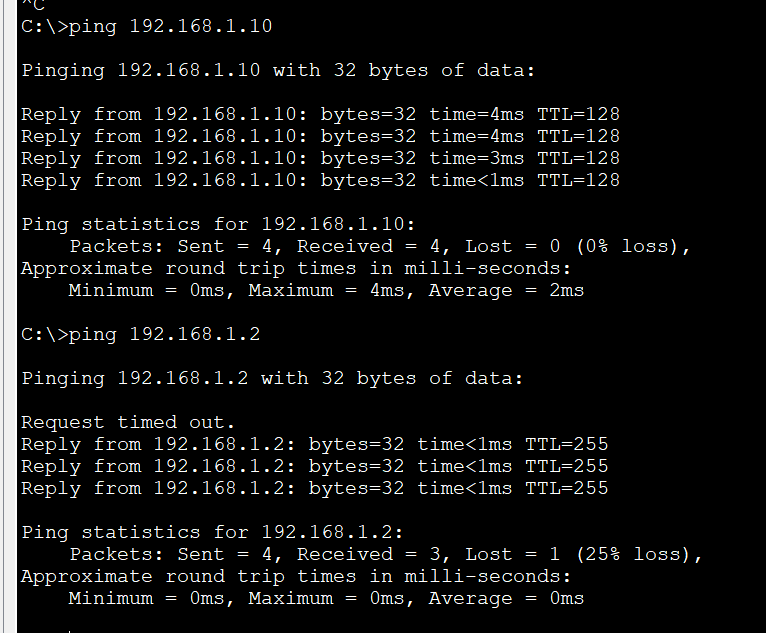
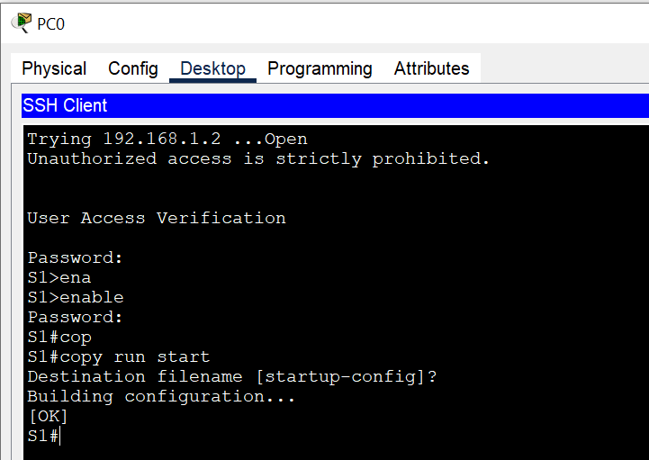

# Базовая конфигурация устройств
### Задачи:
#### Часть 1. Проверка конфигурации коммутатора по умолчанию
#### Часть 2. Создание сети и настройка основных параметров устройства
* Настройте базовые параметры коммутатора.
* Настройте IP-адрес для ПК.
#### Часть 3. Проверка сетевых подключений
* Отобразите конфигурацию устройства.
* Протестируйте сквозное соединение, отправив эхо-запрос.
* Протестируйте возможности удаленного управления с помощью Telnet.

### Решение:
#### Часть 1:
1. Сколько интерфейсов FastEthernet имеется на коммутаторе 2960?  
*- 24 fa интерфейса*  

2. Сколько интерфейсов Gigabit Ethernet имеется на коммутаторе 2960?  
*- 2  gig интерфейса*

3. Каков диапазон значений, отображаемых в vty-линиях?  
*- line vty 0 4*  
*- line vty 5 15*

4. Почему появляется это сообщение в startup configuration?  
*- Мы не обновили и не сохранили файл загрузочной конфигруации. Коммутатор из коробки не имеет конфига.*
```
Switch#sh start
startup-config is not present
```
5. Назначен ли IP-адрес сети VLAN 1?  
*- Не назначен*  

6. Какой MAC-адрес имеет SVI?  
*- 00d0.582d.a477*  

7. Данный интерфейс включен?  
*- интерфейс VLAN 1 административно выключен*  

8. Какие выходные данные вы видите на интерфейсе SVI сети VLAN 1?  
*- IP адрес не назначен*

9. Какие выходные данные вы видите после подключения Ethernet кабеля?  
*- Все так же, мы не включили интерфейс VLAN. После включения интерфейса, он собственно поднялся.*

10. Под управлением какой версии ОС Cisco IOS работает коммутатор?  
*- (C2960-LANBASEK9-M), Version 15.0(2)SE4*

11. Как называется файл образа системы?  
*- flash:c2960-lanbasek9-mz.150-2.SE4.bin*

12. Интерфейс fa0/6 на свиче включен или выключен?  
*- Интерфейс включен*

13. Что нужно сделать, чтобы включить интерфейс?  
*- Подсоединить Ethernet кабель, иногда надо также прописать **no shut** на интерфейсе*

14. Какой MAC-адрес у интерфейса?  
*- 00d0.9735.1a06*

15. Какие настройки скорости и дуплекса заданы в интерфейсе?  
*- Full-duplex, 100Mb/s*

16. Какое имя присвоено образу Cisco IOS?  
*- 2960-lanbasek9-mz.150-2.SE4.bin*

#### Часть 2  
IP адреса на интерефейсе Vlan1 и на PC назначены.  
``` 
S1#
S1#sh running-config | begin Vlan
interface Vlan1
 ip address 192.168.1.2 255.255.255.0
!
ip default-gateway 192.168.1.1
!
banner motd ^C

Unauthorized access is strictly prohibited.^C
!
line con 0
 password 7 0822455D0A16
 logging synchronous
 login
!
line vty 0 4
 password 7 0822455D0A16
 login
line vty 5 15
 password 7 0822455D0A16
 login
```

Для чего нужна команда login?  
*- Для включения/выключения проверки пароля при подключении.*

#### Часть 3  
Какова полоса пропускания этого интерфейса Vlan1?  
*- BW 100000 Kbit*

Проверка соединения между ПК и свичем:  
  
Собственно пока пока проходил ARP запрос - истекло время ожидания.

Проверка удаленного управления коммутатором S1 и сохранение конфига:  
  

⦁	Зачем необходимо настраивать пароль VTY для коммутатора?  
*- Чтобы была возможность подключения к коммутатору по Telnet.*

⦁	Что нужно сделать, чтобы пароли не отправлялись в незашифрованном виде?  
*- В режиме конфигурации прописать **service password-encryption**, собственно команда выплоняет шифрование системных паролей.*

### Приложение А. Инициализация и перезагрузка коммутатора  
⦁	Воспользуйтесь командой show flash, чтобы определить, были ли созданы сети VLAN на коммутаторе.  
*- Файл создан не был, ради интереса создал его при добавлении интерфейса VLAN 2.*  
```
S1#sh flash 
Directory of flash:/
    1  -rw-     4670455          <no date>  2960-lanbasek9-mz.150-2.SE4.bin
    2  -rw-        1351          <no date>  config.text
    3  -rw-         616          <no date>  vlan.dat
```

*- После выполнения команды erase startup-config также пропал файл конфигурации - config.text*  
*- Собственно после удаления конфига и ребута - свич загрузился без начальной конфигурации которую мы выполняли в данной лабораторной*
