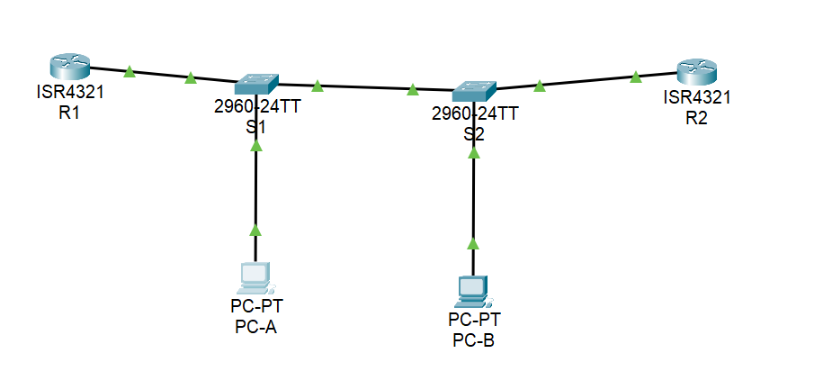
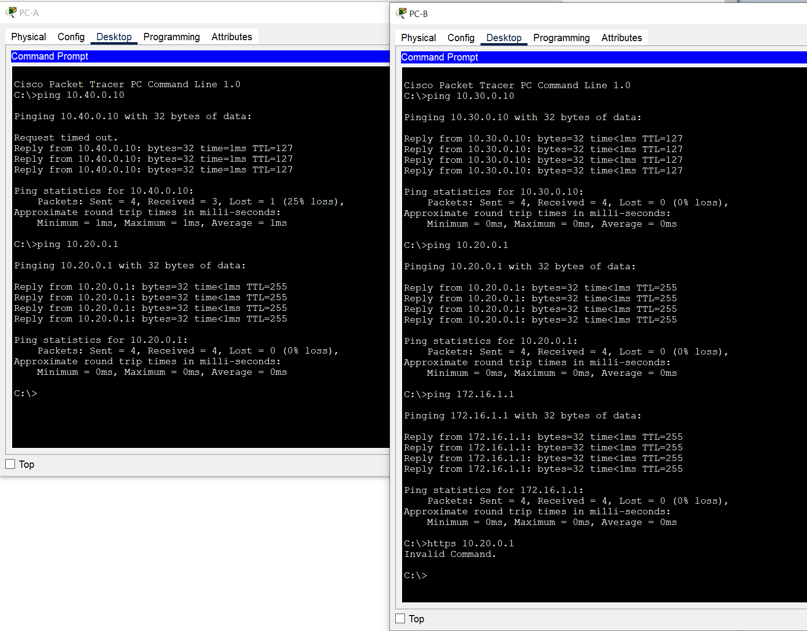
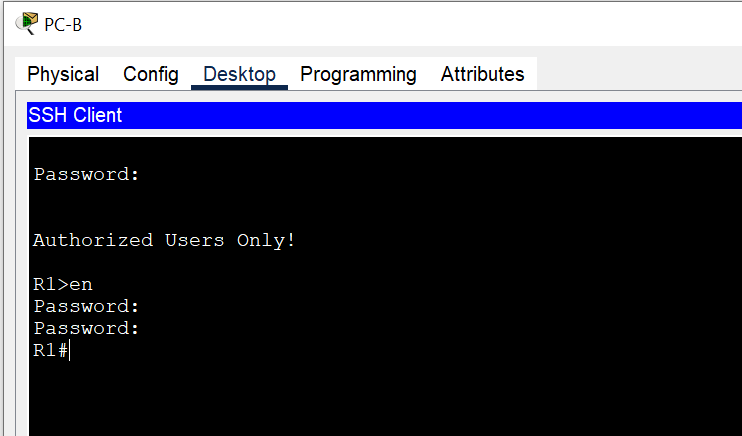
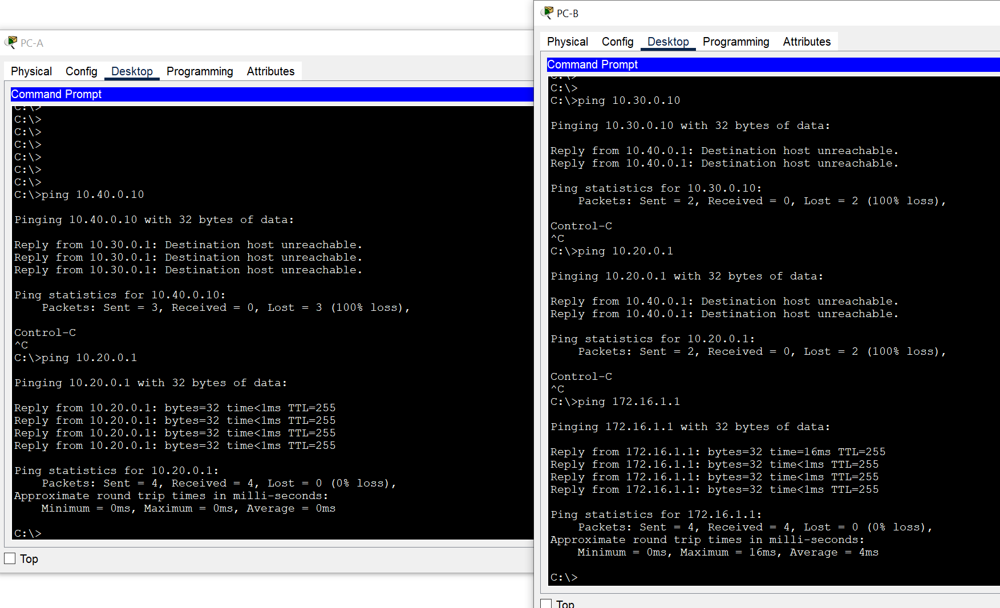
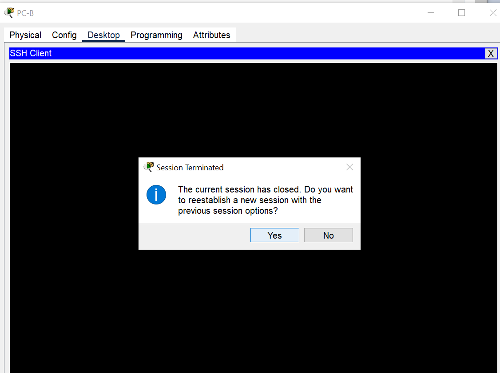

# Настройка и проверка расширенных списков контроля доступа   

### Задачи:
#### Часть 1. Создание сети и настройка основных параметров устройства
#### Часть 2. Настройка и проверка списков расширенного контроля доступа

## Топология: 
  

### Решение:
#### Часть 1: 
Базовые настройки коммутаторов и роутеров выполнены, пароли поставлены.  
Схема адресации:  
Устройство | Интерфейс | IP-адрес | Маска подсети | Default Gateway
:---: | :---: | :---: | :---: | :---:
R1 | G0/0/1 | - | - | -
R1 | G0/0/1.20 | 10.20.0.1 | 255.255.255.0 | -
R1 | G0/0/1.30 | 10.30.0.1 | 255.255.255.0 | -
R1 | G0/0/1.40 | 10.40.0.1 | 255.255.255.0 | -
R1 | G0/0/1.1000 | - | - | -
R1 | Loopback1 | 172.16.1.1 | 255.255.255.0 | -
R2 | G0/0/1 | 10.20.0.4 | 255.255.255.0 | -
S1 | VLAN 20 | 10.20.0.2 | 255.255.255.0 | 10.20.0.1
S2 | VLAN 20 | 10.20.0.3 | 255.255.255.0 | 10.20.0.1
PC-A | NIC | 10.30.0.10 | 255.255.255.0 | 10.30.0.1
PC-B | NIC | 10.40.0.10 | 255.255.255.0 | 10.40.0.1

Таблица VLAN:
VLAN | Имя | Назначенный интерфейс
:---: | :---: | :---:
20 | Management | S2: F0/5 
30 | Operations | S1: F0/6
40 | Sales | S2: F0/18
999 | ParkingLot | S1: F0/2-4, F0/7-24, G0/1-2; S2: F0/2-4, F0/6-17, F0/19-24, G0/1-2
1000 | Native | -

⦁	Настройка сетей VLAN на коммутаторах.  

```
S1#sh vlan brief 

VLAN Name                             Status    Ports
---- -------------------------------- --------- -------------------------------
1    default                          active    Fa0/1, Fa0/5
20   Management                       active    
30   Operations                       active    Fa0/6
40   Sales                            active    
999  ParkingLot                       active    Fa0/2, Fa0/3, Fa0/4, Fa0/7
                                                Fa0/8, Fa0/9, Fa0/10, Fa0/11
                                                Fa0/12, Fa0/13, Fa0/14, Fa0/15
                                                Fa0/16, Fa0/17, Fa0/18, Fa0/19
                                                Fa0/20, Fa0/21, Fa0/22, Fa0/23
                                                Fa0/24, Gig0/1, Gig0/2
1000 Native                           active    
1002 fddi-default                     active    
1003 token-ring-default               active    
1004 fddinet-default                  active    
1005 trnet-default                    active
```

⦁ Настройте транки (магистральные каналы).
```
S1#sh interfaces trunk 
Port        Mode         Encapsulation  Status        Native vlan
Fa0/1       on           802.1q         trunking      1000
Fa0/5       on           802.1q         trunking      1000
Port        Vlans allowed on trunk
Fa0/1       20,30,40,1000
Fa0/5       20,30,40,1000
Port        Vlans allowed and active in management domain
Fa0/1       20,30,40,1000
Fa0/5       20,30,40,1000
Port        Vlans in spanning tree forwarding state and not pruned
Fa0/1       20,30,40,1000
Fa0/5       20,30,40,1000
```

⦁	Настройте маршрутизацию  
```
R1(config)#do sh ip int br
Interface               IP-Address      OK? Method Status                Protocol 
GigabitEthernet0/0/0    unassigned      YES unset  administratively down down 
GigabitEthernet0/0/1    unassigned      YES unset  up                    up 
GigabitEthernet0/0/1.20 10.20.0.1       YES manual up                    up 
GigabitEthernet0/0/1.30 10.30.0.1       YES manual up                    up 
GigabitEthernet0/0/1.40 10.40.0.1       YES manual up                    up 
GigabitEthernet0/0/1.1000 unassigned      YES unset  up                    up 
Loopback1               172.16.1.1      YES manual up                    up 
Vlan1                   unassigned      YES unset  administratively down down
```

⦁	Настройте удаленный доступ  
```
R1(config)#username SSHadmin secret $cisco123!
R1(config)#ip domain name ccna-lab.com
R1(config)#crypto key generate rsa general-keys modulus 1024
% The key modulus size is 1024 bits
% Generating 1024 bit RSA keys, keys will be non-exportable...[OK]
*Mar 1 0:22:24.249: %SSH-5-ENABLED: SSH 1.99 has been enabled
R1(config)#
R1(config)#line vty 0 4
R1(config-line)#transport input ssh 
R1(config-line)#login local 
```
⦁	Включите защищенные веб-службы с проверкой подлинности на R1.  
! В PT нет возможности настроить веб-службы:  
```
R1(config)#ip h?
host  
R1(config)#ip h
```
⦁	Проверка подключения  
Пинг:  
  

SSH:  
  

#### Часть 2. Настройка и проверка списков расширенного контроля доступа
1) Политика1. Сеть Sales не может использовать SSH в сети Management (но в  другие сети SSH разрешен).  
2) Политика 2. Сеть Sales не имеет доступа к IP-адресам в сети Management с помощью любого веб-протокола (HTTP/HTTPS). Сеть Sales также не имеет доступа к интерфейсам R1 с помощью любого веб-протокола. Разрешён весь другой веб-трафик (обратите внимание — Сеть Sales  может получить доступ к интерфейсу Loopback 1 на R1).  
3) Политика3. Сеть Sales не может отправлять эхо-запросы ICMP в сети Operations или Management. Разрешены эхо-запросы ICMP к другим адресатам.   
4) Политика 4: Cеть Operations  не может отправлять ICMP эхозапросы в сеть Sales. Разрешены эхо-запросы ICMP к другим адресатам.


```
R1(config)#access-list 101 remark ACL policy 1,2,3
R1(config)#access-list 101 deny tcp 10.40.0.0 0.0.0.255 10.20.0.0 0.0.0.255 eq 22
R1(config)#access-list 101 deny tcp 10.40.0.0 0.0.0.255 10.20.0.0 0.0.0.255 eq 80
R1(config)#access-list 101 deny tcp 10.40.0.0 0.0.0.255 10.30.0.1 0.0.0.0 eq 80
R1(config)#access-list 101 deny tcp 10.40.0.0 0.0.0.255 10.40.0.1 0.0.0.0 eq 80
R1(config)#access-list 101 deny tcp 10.40.0.0 0.0.0.255 10.20.0.0 0.0.0.255 eq 443
R1(config)#access-list 101 deny tcp 10.40.0.0 0.0.0.255 10.30.0.1 0.0.0.0 eq 443
R1(config)#access-list 101 deny tcp 10.40.0.0 0.0.0.255 10.40.0.1 0.0.0.0 eq 443
R1(config)#access-list 101 deny icmp 10.40.0.0 0.0.0.255 10.20.0.0 0.0.0.255 echo
R1(config)#access-list 101 deny icmp 10.40.0.0 0.0.0.255 10.30.0.0 0.0.0.255 echo
R1(config)#access-list 101 permit ip any any
R1(config)#
R1(config)#
R1(config)#access-list 102 remark ACL policy 4
R1(config)#access-list 102 deny icmp 10.30.0.0 0.0.0.255 10.40.0.0 0.0.0.255 echo
R1(config)#access-list 102 permit ip any any
R1(config)#
R1(config)#interface gigabitEthernet 0/0/1.40
R1(config-subif)#ip access-group 101 in
R1(config)#interface gigabitEthernet 0/0/1.30
R1(config-subif)#ip access-group 102 in
```


⦁	Убедитесь, что политики безопасности применяются развернутыми списками доступа.  
   

SSH to 10.20.0.4 - Сбой:  
  

SSH to 172.16.1.1 - Успех:  
  
