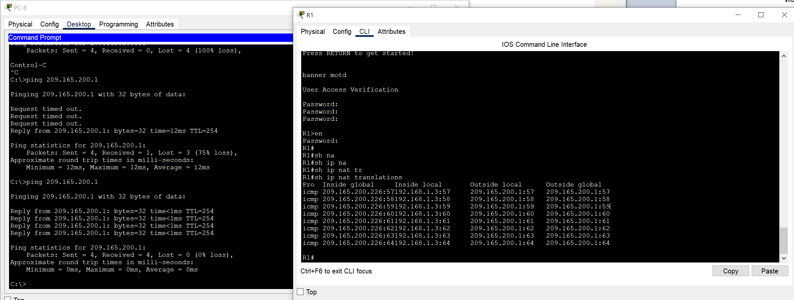
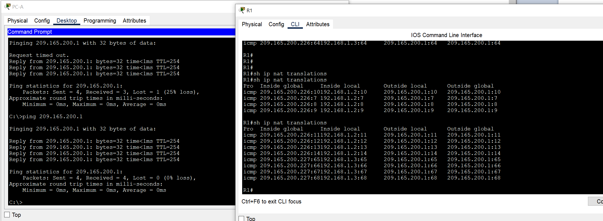
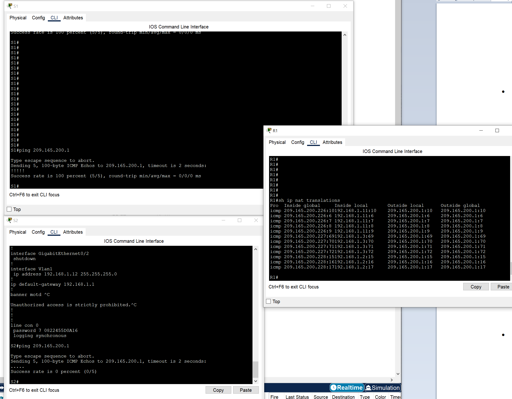
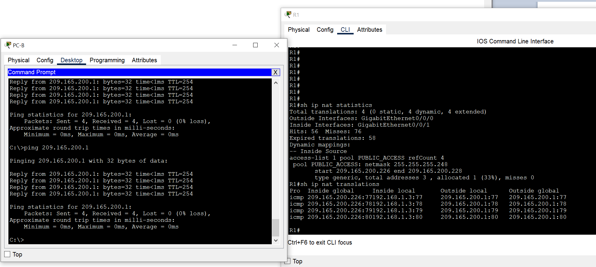
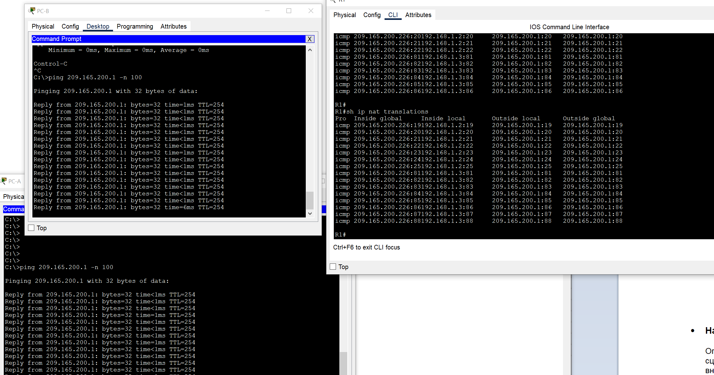
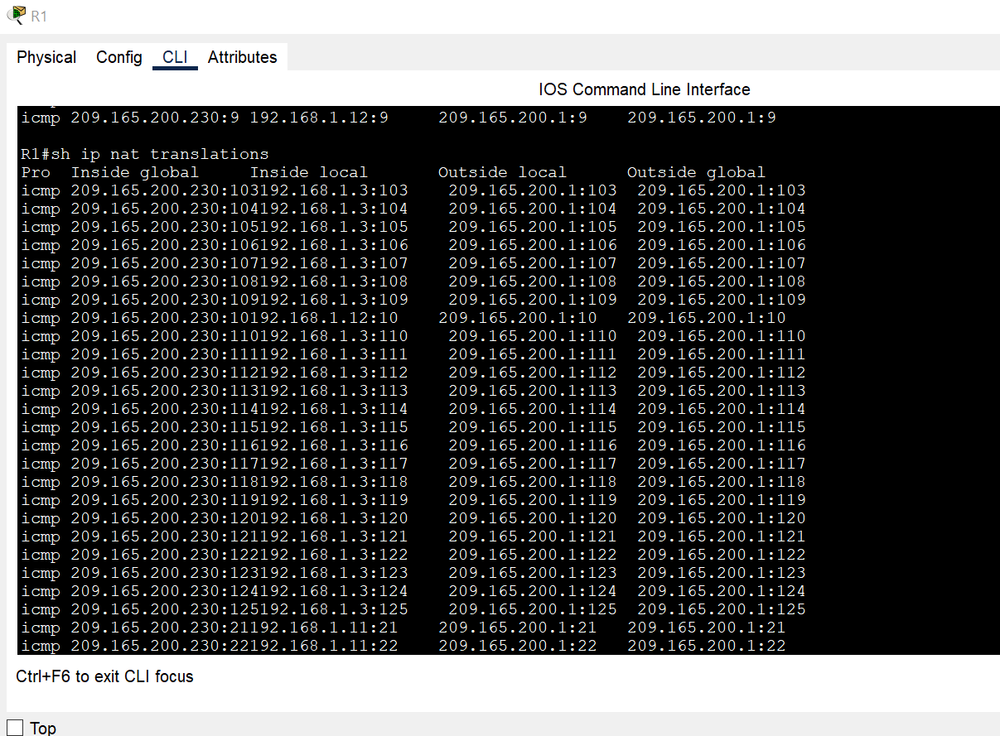
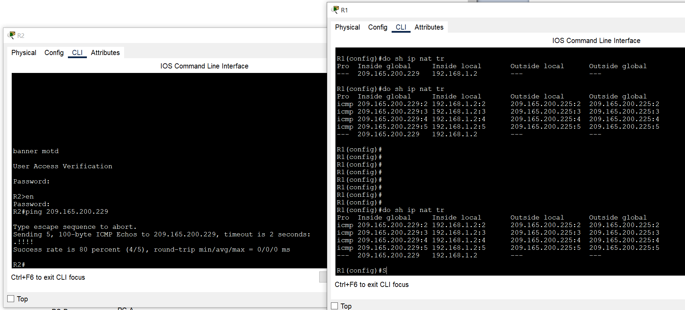

# Настройка NAT для IPv4

### Задачи:
#### Часть 1. Создание сети и настройка основных параметров устройства
#### Часть 2. Настройка и проверка NAT для IPv4
#### Часть 3. Настройка и проверка PAT для IPv4
#### Часть 4. Настройка и проверка статического NAT для IPv4.

## Топология: 
  

### Таблица адресации:  
Устройство | Интерфейс | IP-адрес | Маска подсети 
:---: | :---: | :---: | :---: 
R1 | G0/0/0 | 209.165.200.230 | 255.255.255.248
R1 | G0/0/1  | 192.168.1.1 | 255.255.255.0
R2 | G0/0/0 | 209.165.200.225 | 255.255.255.248
R2 | Loopback 1 | 209.165.200.1 | 255.255.255.248
S1 | VLAN 1 | 192.168.1.11 | 255.255.255.0
S2 | VLAN 1 | 192.168.1.12 | 255.255.255.0
PC-A | NIC | 192.168.1.2 | 255.255.255.0
PC-B | NIC | 192.168.1.3 | 255.255.255.0

### Решение:
#### Часть 1: 
Базовые настройки маршрутизаторов и коммутаторов выполнены, IP адреса прописаны.  

#### Часть 2: Настройка и проверка NAT для IPv4
⦁	Настройте NAT на R1, используя пул из трех адресов 209.165.200.226-209.165.200.228. Команды по заданию:  
```
R1(config)#access-list 1 permit 192.168.1.0 0.0.0.255
R1(config)#ip nat pool PUBLIC_ACCESS 209.165.200.226 209.165.200.228 netmask 255.255.255.248 
R1(config)#ip nat inside source list 1 pool PUBLIC_ACCESS
R1(config)#interface g0/0/1
R1(config-if)#ip nat inside 
R1(config)#
R1(config)#interface gigabitEthernet 0/0/0
R1(config-if)#ip nat outside 
```
⦁	Проверьте и проверьте конфигурацию  
С PC-B,  запустите эхо-запрос интерфейса Lo1 (209.165.200.1) на R2.  
  

Во что был транслирован внутренний локальный адрес PC-B?  
*- 209.165.200.226*  

Какой тип адреса NAT является переведенным адресом?  
*- Inside global*  

⦁	С PC-A, запустите  эхо-запрос интерфейса Lo1 (209.165.200.1) на R2.  
  

⦁	Теперь запускаем пинг R2 Lo1 (209.165.200.1) из S1. 
  

⦁	Теперь запускаем пинг R2 Lo1 из S2. На этот раз перевод завершается неудачей.  
Как много выделено трансляций? Введите команду show ip nat translations verbose , и вы увидите, что ответ будет 24 часа.  
! В PT нет возможности выплонить комнаду **show ip nat translations verbose**, отсутствует. Преобразования NAT отчищаются вроде как в течение минуты.  
Чтобы выполнить неудачный пинг, пришлось со всех 4 устройств запустить почти одновременно.   


#### Часть 3. Настройка и проверка PAT для IPv4  

⦁	Добавьте команду PAT на R1.
⦁	Протестируйте и проверьте конфигурацию
 

Во что был транслирован внутренний локальный адрес PC-B?  
*- 209.165.200.226*  

Какой тип адреса NAT является переведенным адресом?  
*- Inside global*  

Чем отличаются выходные данные команды show ip nat translations из упражнения NAT?  
*- В PT отличий то и нет, если судить по выводу команд из задания, при исользовании PAT нет однозначного присвоения внутреннего адреса внешнему:*  
```
--- 209.165.200.227 192.168.1.2 --- ---
--- 209.165.200.226 192.168.1.3 --- ---
--- 209.165.200.228 192.168.1.11 --- ---
```

⦁	Сгенерировать трафик с нескольких устройств для наблюдения PAT  
Внутренний адрес действительно одинаковый:  
 

Как маршрутизатор отслеживает, куда идут ответы? 
*- Каждому запросу присвоены уникальные номера как понимаю.*

⦁	Добавьте команду PAT overload, указав внешний интерфейс.  
```
R1(config)#no ip nat inside source list 1 pool PUBLIC_ACCESS overload 
R1(config)#no ip nat pool PUBLIC_ACCESS
R1(config)#ip nat inside source list 1 interface g0/0/0 overload 
```

⦁	Сгенерировать трафик с нескольких устройств для наблюдения PAT.  
Теперь все внутренние глобальные адреса сопоставляются с IP-адресом интерфейса g0/0/0.  

  


#### Часть 4. Настройка и проверка статического NAT для IPv4.

⦁	На R1 настройте команду NAT, необходимую для статического сопоставления внутреннего адреса с внешним адресом.  
```
R1(config)#do sh ip nat tr
Pro  Inside global     Inside local       Outside local      Outside global
---  209.165.200.229   192.168.1.2        ---                ---
```

⦁	Запустите пинг с R2 на 209.165.200.229.    
⦁	На R1 отобразите таблицу NAT на R1 с помощью команды show ip nat translations.  

  
