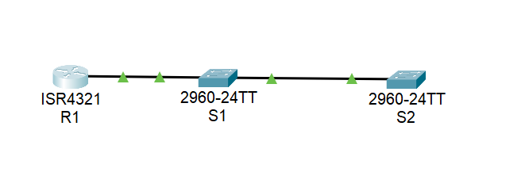

# Настройка протокола OSPFv2 для одной области

### Задачи:
#### Часть 1. Создание сети и настройка основных параметров устройства
#### Часть 2. Обнаружение сетевых ресурсов с помощью протокола CDP
#### Часть 3. Обнаружение сетевых ресурсов с помощью протокола LLDP
#### Часть 4. Настройка и проверка NTP

## Топология: 
  

### Таблица адресации:  
Устройство | Интерфейс | IP-адрес | Маска подсети | Default Gateway
:---: | :---: | :---: | :---: | :---: 
R1 | G0/0/1 | 10.22.0.1 | 255.255.255.0 | -
R1 | Loopback 1  | 172.16.1.1 | 255.255.255.0 | -
S1 | SVI VLAN 1  | 10.22.0.2 | 255.255.255.0 | 10.22.0.1
S2 | SVI VLAN 1  | 10.22.0.3 | 255.255.255.0 | 10.22.0.1

### Решение:
#### Часть 1: 
Базовые настройки маршрутизатора и коммутаторов выполнены, IP адреса прописаны.  

#### Часть 2. Обнаружение сетевых ресурсов с помощью протокола CDP  

```
R1#sh cdp interface 
Vlan1 is administratively down, line protocol is down
  Sending CDP packets every 60 seconds
  Holdtime is 180 seconds
GigabitEthernet0/0/0 is administratively down, line protocol is down
  Sending CDP packets every 60 seconds
  Holdtime is 180 seconds
GigabitEthernet0/0/1 is up, line protocol is up
  Sending CDP packets every 60 seconds
  Holdtime is 180 seconds
```
⦁	Сколько интерфейсов участвует в объявлениях CDP? Какие из них активны?  
*- Учитывая VLAN 1, 3 интрефейса. Активен только включенный интерфейс - g0/0/1.*  

⦁	На R1 используйте соответствующую команду show cdp, чтобы определить версию IOS, используемую на S1.  
```
R1#sh cdp entry S1

Device ID: S1
Entry address(es): 
Platform: cisco 2960, Capabilities: Switch
Interface: GigabitEthernet0/0/1, Port ID (outgoing port): FastEthernet0/5
Holdtime: 139

Version :
Cisco IOS Software, C2960 Software (C2960-LANBASEK9-M), Version 15.0(2)SE4, RELEASE SOFTWARE (fc1)
Technical Support: http://www.cisco.com/techsupport
Copyright (c) 1986-2013 by Cisco Systems, Inc.
Compiled Wed 26-Jun-13 02:49 by mnguyen

advertisement version: 2
Duplex: full
```

⦁	Какая версия IOS используется на  S1?  
*- Cisco IOS Software, C2960 Software (C2960-LANBASEK9-M), **Version 15.0(2)SE4**, RELEASE SOFTWARE (fc1)*  

⦁	На S1 используйте соответствующую команду show cdp, чтобы определить, сколько пакетов CDP было выданных.  
! В CPT отсутсвтует команда **sh cdp traffic**
```
R1#sh cdp ?
  entry      Information for specific neighbor entry
  interface  CDP interface status and configuration
  neighbors  CDP neighbor entries
  <cr>
R1#sh cdp 
```  
⦁	Сколько пакетов имеет выход CDP с момента последнего сброса счетчика?   
*- Ну, судя по выводу в задании - 179 пакетов*  

⦁	Настройте SVI для VLAN 1 на S1 и S2, используя IP-адреса, указанные в таблице адресации выше. Настройте шлюз по умолчанию для каждого коммутатора на основе таблицы адресов.   
⦁	На R1 выполните команду show cdp entry S1.  
```
R1#sh cdp entry S1

Device ID: S1
Entry address(es): 
  IP address : 10.22.0.2
Platform: cisco 2960, Capabilities: Switch
Interface: GigabitEthernet0/0/1, Port ID (outgoing port): FastEthernet0/5
Holdtime: 150

Version :
Cisco IOS Software, C2960 Software (C2960-LANBASEK9-M), Version 15.0(2)SE4, RELEASE SOFTWARE (fc1)
Technical Support: http://www.cisco.com/techsupport
Copyright (c) 1986-2013 by Cisco Systems, Inc.
Compiled Wed 26-Jun-13 02:49 by mnguyen

advertisement version: 2
Duplex: full
```  

⦁	Какие дополнительные сведения доступны теперь?  
*- В выводе появился IP адрес, котороый мы присвоили интерфейсу VLAN 1. Так же Holdtimne поменялся на 150.*  

⦁	Отключить CDP глобально на всех устройствах.  
```
R1(config)#no cdp run 
R1(config)#ex
R1#
R1#sh cdp 
% CDP is not enabled

S1(config)#no cdp run
S2(config)#no cdp run 
``` 

#### Часть 3. Обнаружение сетевых ресурсов с помощью протокола LLDP  
⦁	Введите соответствующую команду lldp, чтобы включить LLDP на всех устройствах в топологии.  
```
R1#sh lldp 
% LLDP is not enabled
R1#
R1(config)#lldp run
R1#
R1#sh lldp 
Global LLDP Information:
    Status: ACTIVE
    LLDP advertisements are sent every 30 seconds
    LLDP hold time advertised is 120 seconds
    LLDP interface reinitialisation delay is 2 seconds

S1(config)#lldp run
S2(config)#lldp run
```

⦁	На S1 выполните соответствующую команду lldp, чтобы предоставить подробную информацию о S2.  
! В CPT отсутсвтует команда **sh lldp entry**
```
S1#sh lldp ?
  neighbors  LLDP neighbor entries
  <cr>
S1#sh lldp
S1#sh lldp neighbors 
Capability codes:
    (R) Router, (B) Bridge, (T) Telephone, (C) DOCSIS Cable Device
    (W) WLAN Access Point, (P) Repeater, (S) Station, (O) Other
Device ID           Local Intf     Hold-time  Capability      Port ID
S2                  Fa0/1          120        B               Fa0/1
R1                  Fa0/5          120        R               Gig0/0/1

Total entries displayed: 2
S1#
S1#
S1#sh lldp neighbors detail 
------------------------------------------------
Chassis id: 0060.47E3.5001
Port id: Fa0/1
Port Description: FastEthernet0/1
System Name: S2
System Description:
Cisco IOS Software, C2960 Software (C2960-LANBASEK9-M), Version 15.0(2)SE4, RELEASE SOFTWARE (fc1)
Technical Support: http://www.cisco.com/techsupport
Copyright (c) 1986-2013 by Cisco Systems, Inc.
Compiled Wed 26-Jun-13 02:49 by mnguyen
Time remaining: 90 seconds
System Capabilities: B
Enabled Capabilities: B
Management Addresses - not advertised
Auto Negotiation - supported, enabled
Physical media capabilities:
    100baseT(FD)
    100baseT(HD)
    1000baseT(HD)
Media Attachment Unit type: 10
Vlan ID: 1
```

⦁	Что такое chassis ID  для коммутатора S2?  
*- Идентификатор шасси для определения соседних устройств через lldp, в нашем случае это Мак адрес коммутатора S2 - **0060.47E3.5001***  


⦁	Соединитесь через консоль на всех устройствах и используйте команды LLDP, необходимые для отображения топологии физической сети только из выходных данных команды show.  
```
R1#sh lldp neighbors 
Device ID           Local Intf     Hold-time  Capability      Port ID
S1                  Gig0/0/1       120        B               Fa0/5

S1#sh lldp neighbors 
Device ID           Local Intf     Hold-time  Capability      Port ID
S2                  Fa0/1          120        B               Fa0/1
R1                  Fa0/5          120        R               Gig0/0/1

S2#sh lldp neighbors 
Device ID           Local Intf     Hold-time  Capability      Port ID
S1                  Fa0/1          120        B               Fa0/1
```  

#### Часть 4. Настройка и проверка NTP  
⦁	Выведите на экран текущее время. Запишите текущее время, в таблице.   
```
R1#sh clock 
*0:30:57.882 UTC Mon Mar 1 1993
```
Дата | Время | Часовой пояс | Источник времкени
:---: | :---: | :---: | :---:
01.03.1993 | 00:30:57 | UTC | нет, собственные часы устройства  

⦁	Установите время.  
```
R1#clock set 11:56:30 17 January 2026
R1#sh clock 
11:56:39.728 UTC Sat Jan 17 2026
```

⦁	Настройте главный сервер NTP.  
```
R1(config)#ntp master 4
```

⦁	Настройте клиент NTP.  
⦁	Выполните соответствующую команду на S1 и S2, чтобы просмотреть настроенное время. Запишите текущее время, в таблице.  
Дата | Время | Часовой пояс | 
:---: | :---: | :---: |
01.03.1993 | 00:35:20 | UTC | 

⦁	Настройте S1 и S2 в качестве клиентов NTP.  

```
S1(config)# ntp server 10.22.0.1
S1#
S1#sh ntp status 
Clock is synchronized, stratum 16, reference is 10.22.0.1
nominal freq is 250.0000 Hz, actual freq is 249.9990 Hz, precision is 2**24
reference time is 2AB767C7.000003AC (23:27:3.940 UTC Thu Dec 5 2058)
clock offset is 0.00 msec, root delay is 0.00  msec
root dispersion is 10.06 msec, peer dispersion is 0.12 msec.
loopfilter state is 'CTRL' (Normal Controlled Loop), drift is - 0.000001193 s/s system poll interval is 4, last update was 8 sec ago.
S1#
S1#sh clock 
12:4:57.306 UTC Sat Jan 17 2026

S1#sh ntp associations 
address         ref clock       st   when     poll    reach  delay          offset            disp
*~10.22.0.1     127.127.1.1     4    6        16      11     0.00           0.00              0.00

S2#sh clock 
12:6:53.730 UTC Sat Jan 17 2026
S2#sh ntp associations 
address         ref clock       st   when     poll    reach  delay          offset            disp
*~10.22.0.1     127.127.1.1     4    0        16      377    0.00           0.00              0.12
```

#### Вопрос для повторения  
Для каких интерфейсов в пределах сети не следует использовать протоколы обнаружения сетевых ресурсов? Поясните ответ.  
*- Не стоит использовать протоколы обнаружения для интерфейсов, которые смотрят во внешнюю сеть. 
Как мы убедились, эти протоколы предоставляют информацию о сети - какие устройства использужются, какие IP. 
Данная информация является чувтсвтельной, поэтому не стоит ее передоавать в интернеты.*
