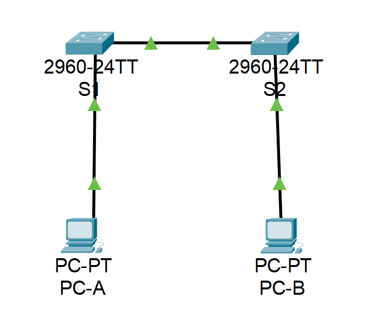

# Изучение таблицы МАС-адресов коммутатора
## Топология:  


### Задачи:
#### Часть 1. Создание и настройка сети
#### Часть 2. Изучение таблицы МАС-адресов коммутатора

### Решение:
#### Часть 1:  
Базовые настройки коммутаторов выполнены, IP-адреса навешаны. Пароли поставлены.
#### Часть 2:

1. Назовите физические адреса адаптера Ethernet на ПК  
⦁	MAC-адрес компьютера PC-A:  
*- Physical Address................: 0004.9A34.28DD*  
⦁	MAC-адрес компьютера PC-B:  
*- Physical Address................: 0060.702A.4E11*

2. Назовите физические адреса интерфейсов fa0/1 на коммутаторах  
⦁	МАС-адрес коммутатора S1 Fast Ethernet 0/1:  
*- 00d0.9735.1a01*  
⦁	МАС-адрес коммутатора S2 Fast Ethernet 0/1:  
*- 0002.4ae0.ba01*

3. Записаны ли в таблице МАС-адресов на коммутаторе S2 какие-либо МАС-адреса?  
С какими портами коммутатора они сопоставлены и каким устройствам принадлежат?  
*- Да, мы видим мак коммутатора S1 через порт Fa0/1.*  
```
S2#sh mac address-table 
          Mac Address Table
-------------------------------------------
Vlan    Mac Address       Type        Ports
----    -----------       --------    -----
   1    00d0.9735.1a01    DYNAMIC     Fa0/1
```

4. Как можно определить, каким устройствам принадлежат МАС-адреса, используя только выходные данные команды show mac address-table?  
*- Можно использовать онлайн базы по соотношению MAC-адрес c производителем оборудования.*  
*- Если мы говорим только в рамках лабораторной, то понять, какому оборудованию принадлежит MAC можно по порту.*  
5. Работает ли это решение в любой ситуации?  
*- Используя онлайн базы мы узнаем только производителя оборудования, но не поймем, что это именно за устройство.*  
*- В рамках лабораторной работает только когда нам известно оборудование за указанным портом.*

5. Очистите таблицу МАС-адресов коммутатора S2 и снова отобразите таблицу МАС-адресов.
Указаны ли в таблице МАС-адресов адреса для VLAN 1 после выполнения команды clear? Указаны ли другие МАС-адреса?  
*- Не указаны, мы очистили таблицу динамически полученных мак адерсов. Через 10 секунд мак адрес S1 снова появился.*  
```
S2#clear mac address-table dynamic
S2# 
S2#sh mac address-table 
          Mac Address Table
-------------------------------------------
Vlan    Mac Address       Type        Ports
----    -----------       --------    -----
S2#
S2#sh mac address-table 
          Mac Address Table
-------------------------------------------
Vlan    Mac Address       Type        Ports
----    -----------       --------    -----
   1    00d0.9735.1a01    DYNAMIC     Fa0/1
```

6. Не считая адресов многоадресной и широковещательной рассылки, сколько пар IP- и МАС-адресов устройств было получено через протокол ARP на PC-B?  
*- При введении команды **arp-a** мы получаем ответ **No ARP Entries Found**, поскольку с PC-B еще не отправлялись эхо-запросы.*
   
7. От всех ли устройств получены ответы после отправки эхо-заросов?  
*- Да, ото всех. От S1 и S2 получили **Request timed out.** на первый Reply, т.к. ПК и свичи обменивались арп запросами и записывали информацию в кэш.*
```
C:\>ping 192.168.1.1
Ping statistics for 192.168.1.1:
    Packets: Sent = 4, Received = 4, Lost = 0 (0% loss),

C:\>ping 192.168.1.11
Request timed out.
Reply from 192.168.1.11: bytes=32 time<1ms TTL=255
Ping statistics for 192.168.1.11:
    Packets: Sent = 4, Received = 3, Lost = 1 (25% loss),

C:\>ping 192.168.1.12
Request timed out.
Reply from 192.168.1.12: bytes=32 time<1ms TTL=255
Ping statistics for 192.168.1.12:
    Packets: Sent = 4, Received = 3, Lost = 1 (25% loss),
```

9. Добавил ли коммутатор S2 в таблицу МАС-адресов дополнительные МАС-адреса? Если да, то какие адреса и устройства?  
*- Да, добавил 3 мак адерса.*
```
S2#sh mac address-table dynamic 
          Mac Address Table
-------------------------------------------
Vlan    Mac Address       Type        Ports
----    -----------       --------    -----
   1    0004.9a34.28dd    DYNAMIC      Fa0/1    - Мак PC-A
   1    0060.702a.4e11    DYNAMIC      Fa0/18   - Мак PC-B
   1    00d0.582d.a477    DYNAMIC      Fa0/1    - Мак интерфейса Vlan1 на S1
   1    00d0.9735.1a01    DYNAMIC      Fa0/1    - Мак интерфейса fa0/1 на S1
```

9. Появились ли в ARP-кэше компьютера PC-B дополнительные записи для всех сетевых устройств, которым были отправлены эхо-запросы?  
*- Да, в кэше появились мак адреса обоих коммутаторов и PC-A.*  
```
C:\>arp -a
  Internet Address      Physical Address      Type
  192.168.1.1           0004.9a34.28dd        dynamic
  192.168.1.11          00d0.582d.a477        dynamic
  192.168.1.12          0006.2a1d.aa90        dynamic
```

#### Вопрос для повторения:  
В сетях Ethernet данные передаются на устройства по соответствующим МАС-адресам. Для этого коммутаторы и компьютеры динамически создают ARP-кэш и таблицы МАС-адресов. Если компьютеров в сети немного, эта процедура выглядит достаточно простой. Какие сложности могут возникнуть в крупных сетях?  

*- Увеличение времени на получение/запись мак адресов. Увелчиение нагрузки на ЦП и память утсройств. Большое колличество широковещательных запросов, что в свою очередь снижает производительность сети. Если у нас не настроен STP, можем получить широковещательный шторм.*
