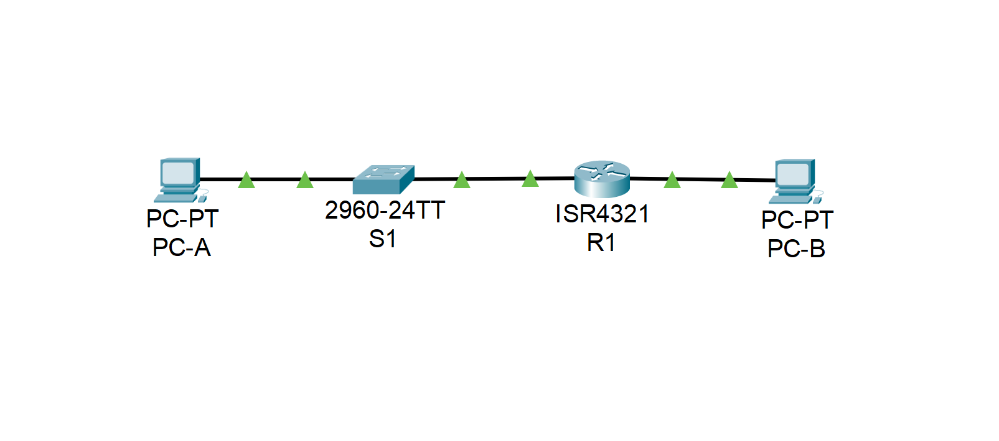
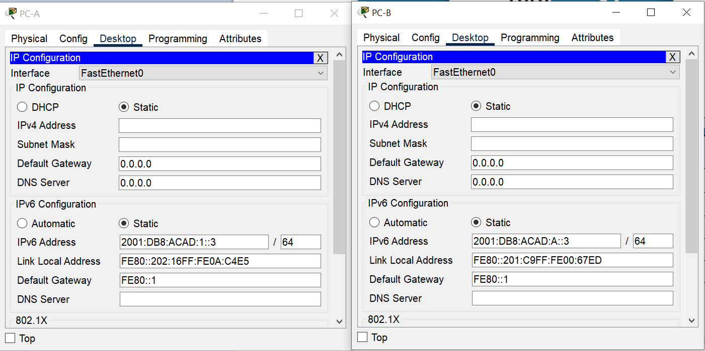
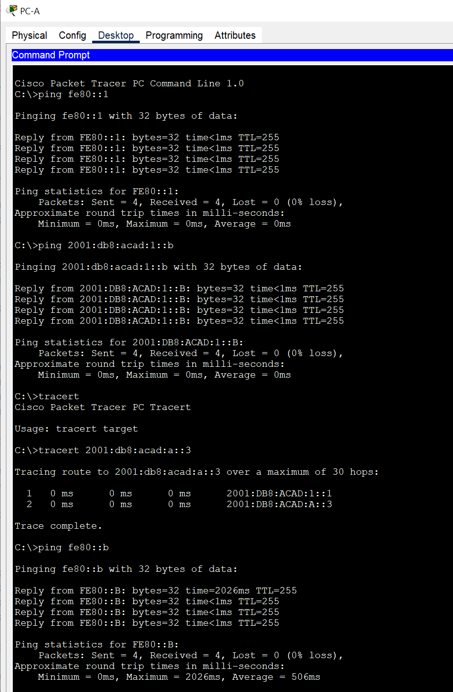
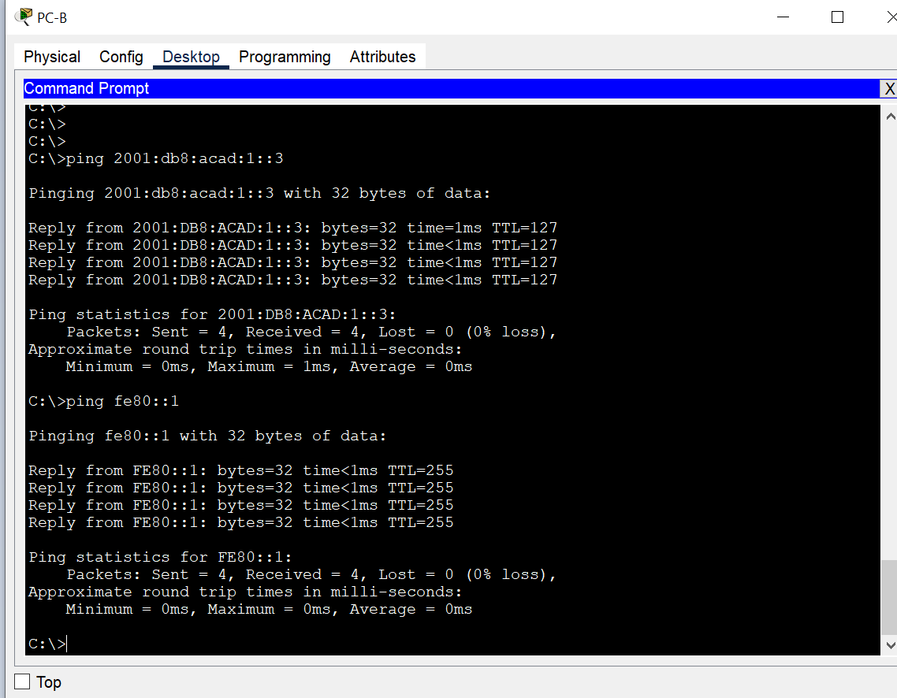
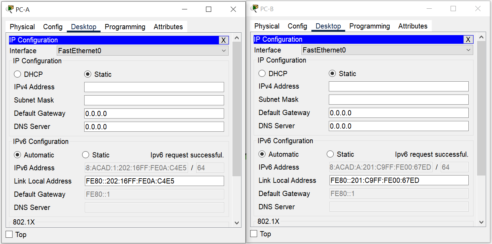
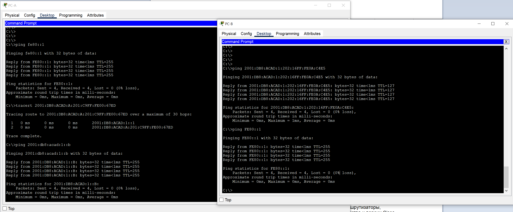

# IPv6 адресация

### Задачи:
#### Часть 1. Настройка топологии и конфигурация основных параметров маршрутизатора и коммутатора
#### Часть 2. Ручная настройка IPv6-адресов
#### Часть 3. Проверка сквозного соединения

## Топология: 
  

### Решение:
Проверка и настройка параметров менеджера базы данных SDM на коммутаторе S1:
```
S1(config)#do sh sdm prefer
 The current template is "default" template.
 The selected template optimizes the resources in
 the switch to support this level of features for
 0 routed interfaces and 1024 VLANs.
```
```
S1(config)#sdm prefer dual-ipv4-and-ipv6 default
S1#reload

S1#sh sdm prefer 
 The current template is "dual-ipv4-and-ipv6 default" template.
 The selected template optimizes the resources in
 the switch to support this level of features for
 0 routed interfaces and 1024 VLANs.
```
Настройка IPv6 адресации на роутере R1
```
R1(config)#interface gigabitEthernet 0/0/0
R1(config-if)#ipv6 address 2001:db8:acad:a::1/64
R1(config-if)#no shutdown 

R1(config-if)#int gi0/0/1
R1(config-if)#ipv6 address 2001:db8:acad:1::1/64
R1(config-if)#no sh
```
Проверка настроек IPv6 адресации на R1
```
R1#sh ipv6 interface brief 
GigabitEthernet0/0/0       [up/up]
    FE80::201:64FF:FEE3:D301
    2001:DB8:ACAD:A::1
GigabitEthernet0/0/1       [up/up]
    FE80::201:64FF:FEE3:D302
    2001:DB8:ACAD:1::1
```
Смена локальных адресов канала
```
R1(config-if)#ipv6 address fe80::1 link-local
R1#
R1#sh ipv6 interface brief 
GigabitEthernet0/0/0       [up/up]
    FE80::1
    2001:DB8:ACAD:A::1
GigabitEthernet0/0/1       [up/up]
    FE80::1
    2001:DB8:ACAD:1::1
```
#### Какие группы многоадресной рассылки назначены интерфейсу G0/0?  
*- Группа многоадресной рассылки для всех узлов (All Nodes) - ff02::1*  


Проверка адреса на PC-B  
```
C:\>ipconfig
FastEthernet0 Connection:(default port)

   Connection-specific DNS Suffix..: 
   Link-local IPv6 Address.........: FE80::201:C9FF:FE00:67ED
   IPv6 Address....................: ::
   IPv4 Address....................: 0.0.0.0
   Subnet Mask.....................: 0.0.0.0
   Default Gateway.................: ::
                                     0.0.0.0
```
#### Назначен ли индивидуальный IPv6-адрес сетевой интерфейсной карте (NIC) на PC-B?
*- Нет, только Link-local IPv6 адрес*  

Активация IPv6-маршрутизации на R1  
```
R1(config)#ipv6 unicast-routing 
R1(config)#

C:\>ipconfig
FastEthernet0 Connection:(default port)

   Connection-specific DNS Suffix..: 
   Link-local IPv6 Address.........: FE80::201:C9FF:FE00:67ED
   IPv6 Address....................: 2001:DB8:ACAD:A:201:C9FF:FE00:67ED
   IPv4 Address....................: 0.0.0.0
   Subnet Mask.....................: 0.0.0.0
   Default Gateway.................: FE80::1
                                     0.0.0.0
```
#### Почему PC-B получил глобальный префикс маршрутизации и идентификатор подсети, которые вы настроили на R1?
*- Вообще, в Packet tracer изначально ПК не получил префикс и идентификатор. Необходимо было сменить IPv6 конфигурацию на автоматическую.   
А так, на роутере R1 все интерфейсы IPv6 теперь являются частью многоадресной группы всех маршрутизаторов (All router), FF02::2.  
Это позволяет роутеру отправлять сообщения RA с информацией о префиксе всем узлам в локальной сети, используя свой локальный адрес канала - fe80::1 в качестве IPv6-адреса источника. Подключенные устройства будут использовать его как свой шлюз по умолчанию.*  

Назначить IPv6-адреса интерфейсу управления (SVI) на S1.
```
S1#conf t
S1(config)#interface vlan 1
S1(config-if)#ipv6 address 2001:db8:acad:1::b/64
S1(config-if)#ipv6 address fe80::b link-local

S1#sh ipv6 interface vlan 1
Vlan1 is up, line protocol is up
  IPv6 is enabled, link-local address is FE80::B
  No Virtual link-local address(es):
  Global unicast address(es):
    2001:DB8:ACAD:1::B, subnet is 2001:DB8:ACAD:1::/64
  Joined group address(es):
    FF02::1
    FF02::1:FF00:B
  MTU is 1500 bytes
```

Проверка работы со статикой на обоих ПК:
    
ПК-А  
    
ПК-Б


Проверка работы со SLAAC на обоих ПК:
  
Сразу с обоих ПК  
  

## Вопросы для повторения
#### Почему обоим интерфейсам Ethernet на R1 можно назначить один и тот же локальный адрес канала — FE80::1?
*- Link-local пакеты никогда не покидают локальную сеть, поэтому один и тот же локальный адрес канала может использоваться и на других интерфейсах.*  

#### Какой идентификатор подсети в индивидуальном IPv6-адресе 2001:db8:acad::aaaa:1234/64?
*- 0000. Префикс маршрутизации A/48 + 16-битный идентификатор подсети = префикс /64.   
В указанном адресе, идентификатор подсети указан как "::", а значит все значения - нули.*
