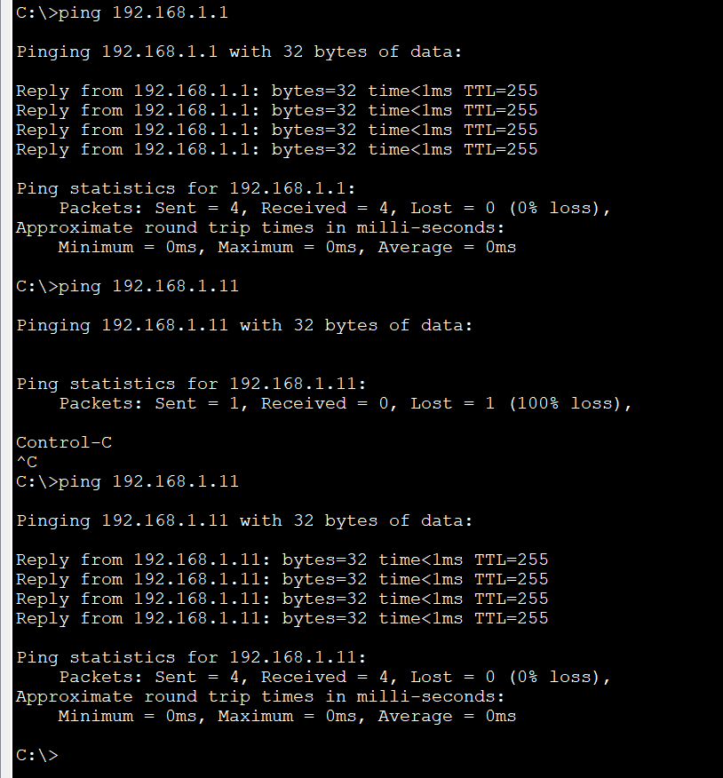
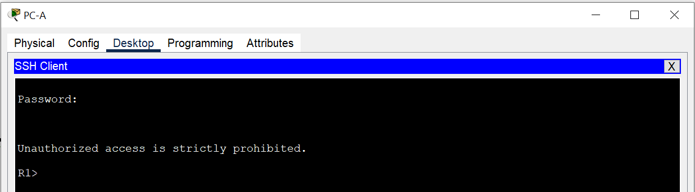

# Доступ к сетевым устройствам по протоколу SSH

### Задачи:
#### Часть 1. Настройка основных параметров устройства
#### Часть 2. Настройка маршрутизатора для доступа по протоколу SSH
#### Часть 3. Настройка коммутатора для доступа по протоколу SSH
#### Часть 4. SSH через интерфейс командной строки (CLI) коммутатора

## Топология: 
  

### Решение:
#### Часть 1:  
Базовые настройки коммутатора и роутера выполнены, IP-адреса навешаны. Пароли поставлены, пинг проходит:  
  

#### Часть 2:  
Настройка маршрутизатора для доступа по SSH:  
```
R1(config)##ip domain-name Otus
R1(config)#crypto key generate rsa
The name for the keys will be: R1.Otus
Choose the size of the key modulus in the range of 360 to 2048 for your
  General Purpose Keys. Choosing a key modulus greater than 512 may take
  a few minutes.

How many bits in the modulus [512]: 1024
% Generating 1024 bit RSA keys, keys will be non-exportable...[OK]
*Mar 1 0:24:29.683: %SSH-5-ENABLED: SSH 1.99 has been enabled
```
Настройка пользователя и VTY линий:  
```
R1(config)#username admin secret Adm1nP@55
R1(config)#line vty 0 4
R1(config-line)#transport input ssh
R1(config-line)#login local 
```
Проверка доступа по ssh с ПК:  
Можно проверить из консоли: 
```
C:\>ssh -l admin 192.168.1.1

Password: 

Unauthorized access is strictly prohibited.

R1>
```
Или через ssh клиент:  
  


#### Часть 3:  
Настройка маршрутизатора для доступа по SSH:  
Выполнены те же действия, что и с роутером.  
SSH соединение есть, проверить можно точно так же:  
Через консоль:  
```
C:\>ssh -l admin 192.168.1.11

Password: 

Unauthorized access is strictly prohibited.

S1>ex
[Connection to 192.168.1.11 closed by foreign host]
```
Или через клиент ssh:
 

#### Часть 4:
Установка ssh соедениения на свиче с роутером:
```
S1#ssh -l admin 192.168.1.1

Password: 

Unauthorized access is strictly prohibited.

R1>
R1>
(Нажал клавиши Ctrl+Shift+6 и потом х, произошло возвращение в EXEC режим на свиче)
S1#
S1# (нажал Enter)
[Resuming connection 1 to 192.168.1.1 ... ]

R1>exit

[Connection to 192.168.1.1 closed by foreign host]
```

Какие версии протокола SSH поддерживаются при использовании интерфейса командной строки?  
*- SSH v1 и v2  
R1#ssh -v ?  
  1  Protocol Version 1  
  2  Protocol Version 2*  

Как предоставить доступ к сетевому устройству нескольким пользователям, у каждого из которых есть собственное имя пользователя?  
*- Необходимо добавить каждого пользователя в локальную базу данных командой username. Если рассматривать более глобально, то лучше использовать ААА(Аутентификация, авторизация и учет) сервера - Radius или Tacacs*
