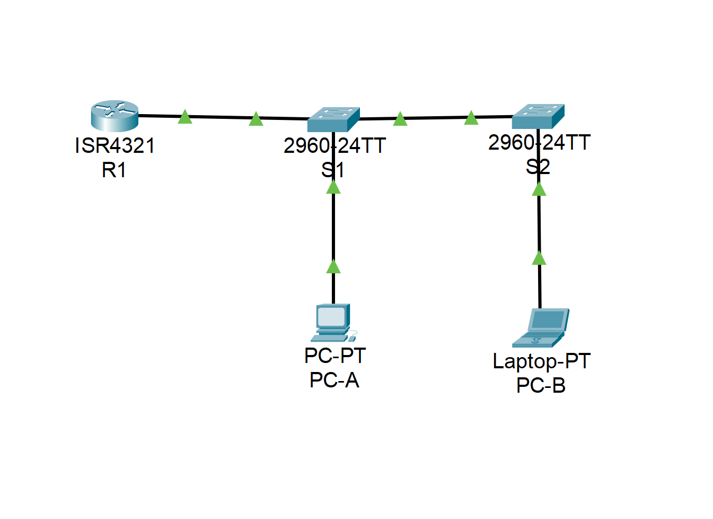
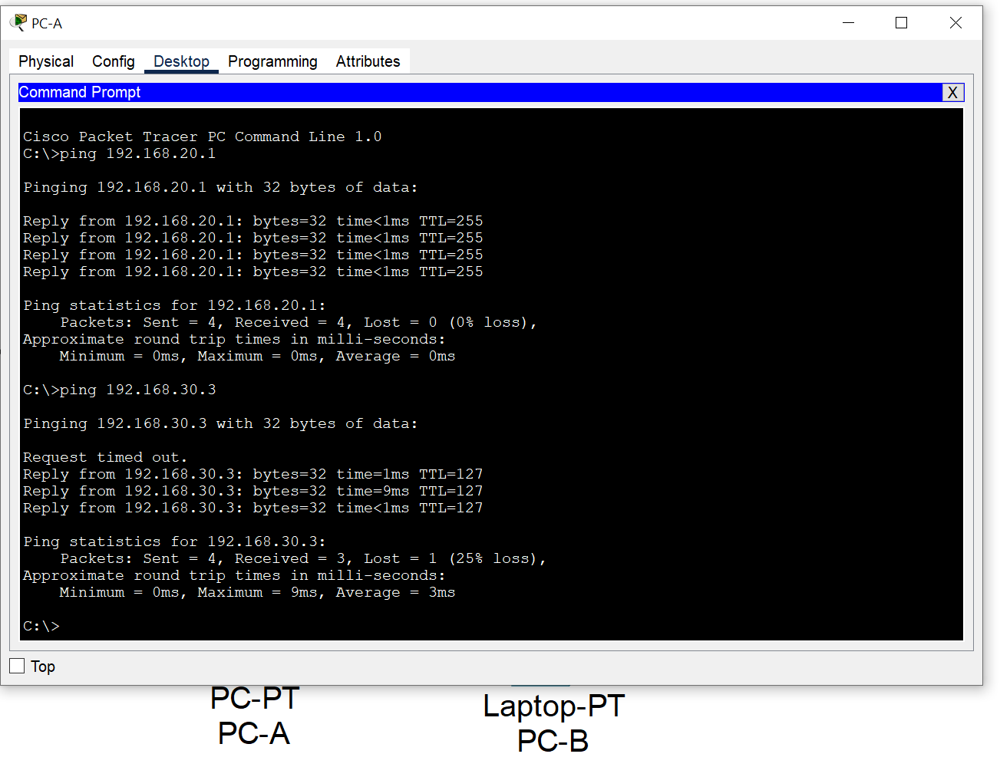
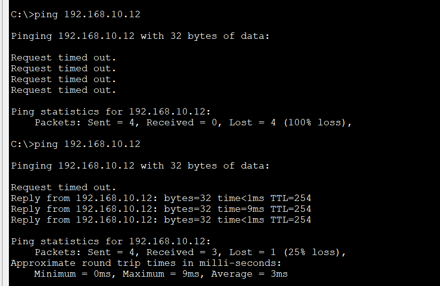

# Внедрение маршрутизации между виртуальными локальными сетями

### Задачи:
#### Часть 1. Создание сети и настройка основных параметров устройства
#### Часть 2. Создание сетей VLAN и назначение портов коммутатора
#### Часть 3. Настройка транка 802.1Q между коммутаторами
#### Часть 4. Настройка маршрутизации между сетями VLAN
#### Часть 5. Проверка, что маршрутизация между VLAN работает

## Топология: 
  

### Решение:
#### Часть 1: 
Базовые настройки коммутаторов и роутера выполнены, пароли поставлены. Адресация на ПК настреона  
#### Часть 2:  
Создание и наименование VLAN:
```
S1(config)#vlan 10
S1(config-vlan)#name Management
S1(config-vlan)#vlan 20
S1(config-vlan)#name Sales
S1(config-vlan)#vlan 30
S1(config-vlan)#name Operations
S1(config-vlan)#vlan 999
S1(config-vlan)#name Parking_Lot
```
Назначение интерфейса управления и шлюза  
```
S1#sh running-config | b interface Vlan10
interface Vlan10
 ip address 192.168.10.11 255.255.255.0
!
ip default-gateway 192.168.10.1
!
```
Назначение всех неиспользуемых портов VLAN 999 и их отключение  
```
S1(config)#interface range f0/7-f0/24
S1(config-if-range)#sh
%LINK-5-CHANGED: Interface FastEthernet0/7, changed state to administratively down
%LINK-5-CHANGED: Interface FastEthernet0/8, changed state to administratively down
%LINK-5-CHANGED: Interface FastEthernet0/9, changed state to administratively down
...
S1(config-if-range)switchport mode access
S1(config-if-range)#switchport access vlan 999
```
Назначение портов соответстующим VLAN:
```
S1#sh vlan 

VLAN Name                             Status    Ports
---- -------------------------------- --------- -------------------------------
1    default                          active    Fa0/1, Fa0/5
10   Management                       active    
20   Sales                            active    Fa0/6
30   Operations                       active    
999  Parking_Lot                      active    Fa0/2, Fa0/3, Fa0/4, Fa0/7
                                                Fa0/8, Fa0/9, Fa0/10, Fa0/11
                                                Fa0/12, Fa0/13, Fa0/14, Fa0/15
                                                Fa0/16, Fa0/17, Fa0/18, Fa0/19
                                                Fa0/20, Fa0/21, Fa0/22, Fa0/23
                                                Fa0/24, Gig0/1, Gig0/2
```
#### Часть 3:  
Настройка интерфейсов Fa0/1 на обоих свичах в режиме trunk.  
Настройка интерфейса Fa0/5 на S1 с такими же параметрами транка.
```
S1(config-if)#do sh r
interface FastEthernet0/1
 switchport trunk native vlan 1000
 switchport trunk allowed vlan 10,20,30,1000
 switchport mode trunk

Пока не был настроен тот же Native Vlan на ответом свиче, выпадала ошибка:
%CDP-4-NATIVE_VLAN_MISMATCH: Native VLAN mismatch discovered on FastEthernet0/1 (1000), with S2 FastEthernet0/1 (1).
```
Что произойдет, если G0/0/1 на R1 будет отключен?  
*- Порт на свиче будет в стостоянии Down, роутер будет недоступен, маршрутизация между VLAN будет недоступна.*

#### Часть 4:  
Если забыли прописать инкасуляцию на сабинтрефейсе, то получим следующую ошибку:
```
R1(config-subif)#ip address 192.168.10.1 255.255.255.0

% Configuring IP routing on a LAN subinterface is only allowed if that
subinterface is already configured as part of an IEEE 802.10, IEEE 802.1Q,
or ISL vLAN.
```
Для правильной настройки необходимо прописать комнаду *encapsulation dot1Q 10* для сабинтерфейса gi0/0/1.10 и т.д.  

Проверка настроек сабинтерфейсов:
```
interface GigabitEthernet0/0/1
 no ip address
 duplex auto
 speed auto
!
interface GigabitEthernet0/0/1.10
 description Management
 encapsulation dot1Q 10
 ip address 192.168.10.1 255.255.255.0
!
interface GigabitEthernet0/0/1.20
 description Sales
 encapsulation dot1Q 20
 ip address 192.168.20.1 255.255.255.0
!
interface GigabitEthernet0/0/1.30
 description Operations
 encapsulation dot1Q 30
 ip address 192.168.30.1 255.255.255.0
!
interface GigabitEthernet0/0/1.1000
 encapsulation dot1Q 1000 native
 no ip address
```

Проверки:  
⦁	Отправьте эхо-запрос с PC-A на шлюз по умолчанию.  
⦁	Отправьте эхо-запрос с PC-A на PC-B.   
⦁	Отправьте команду ping с компьютера PC-A на коммутатор S2.  

 
 

 С ПК_А не пинговался свич S2, при проверке понял, что на S2 забыл прописать шлюз по умолчанию. После указания шлюза, пинг прошел:  
  

В окне командной строки на PC-B выполните команду tracert на адрес PC-A.  
Вопрос:  
Какие промежуточные IP-адреса отображаются в результатах?  
*- Сначала первый хоп - шлюз по умолчанию для PC-B, потом уже запрашиваемый хост:*  
```
C:\> tracert 192.168.20.3
Tracing route to 192.168.20.3 over a maximum of 30 hops: 
  1   0 ms      0 ms      0 ms      192.168.30.1
  2   0 ms      0 ms      0 ms      192.168.20.3
```
