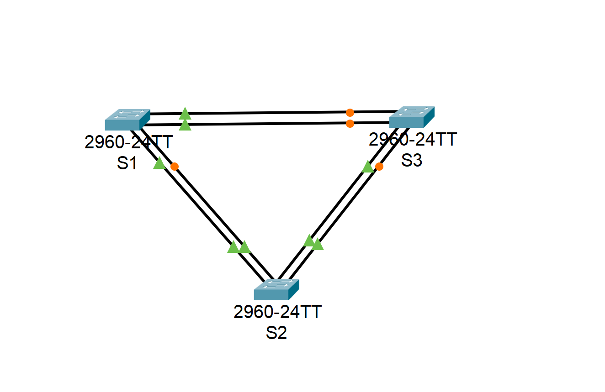
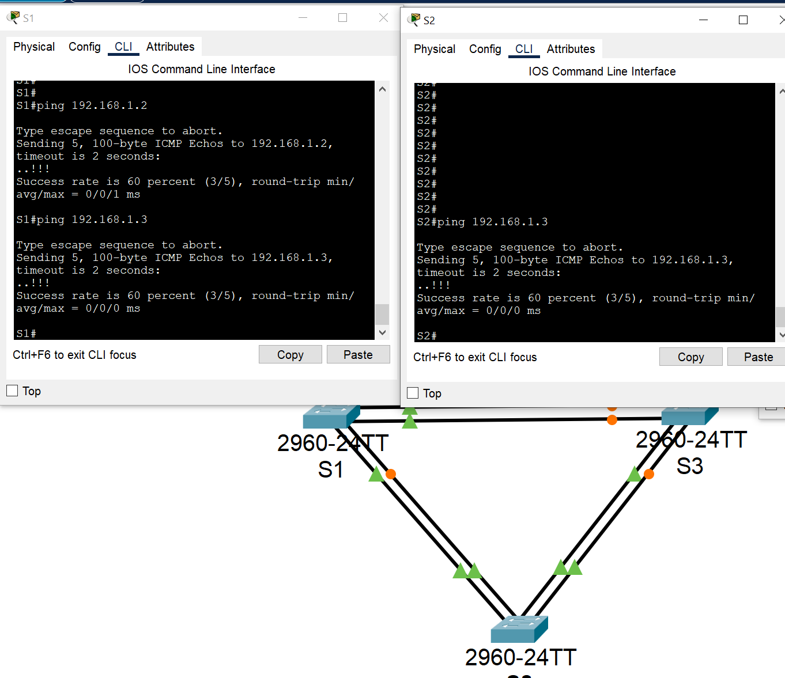
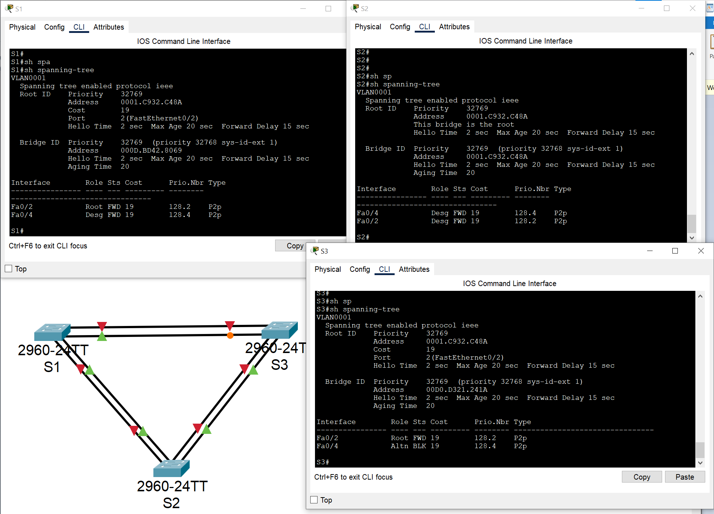
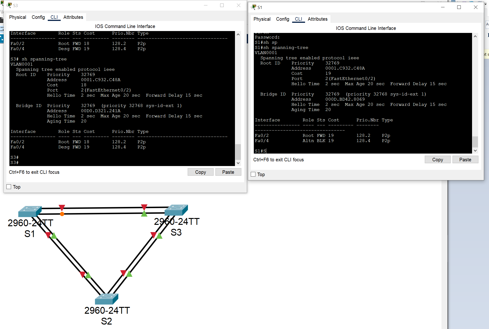
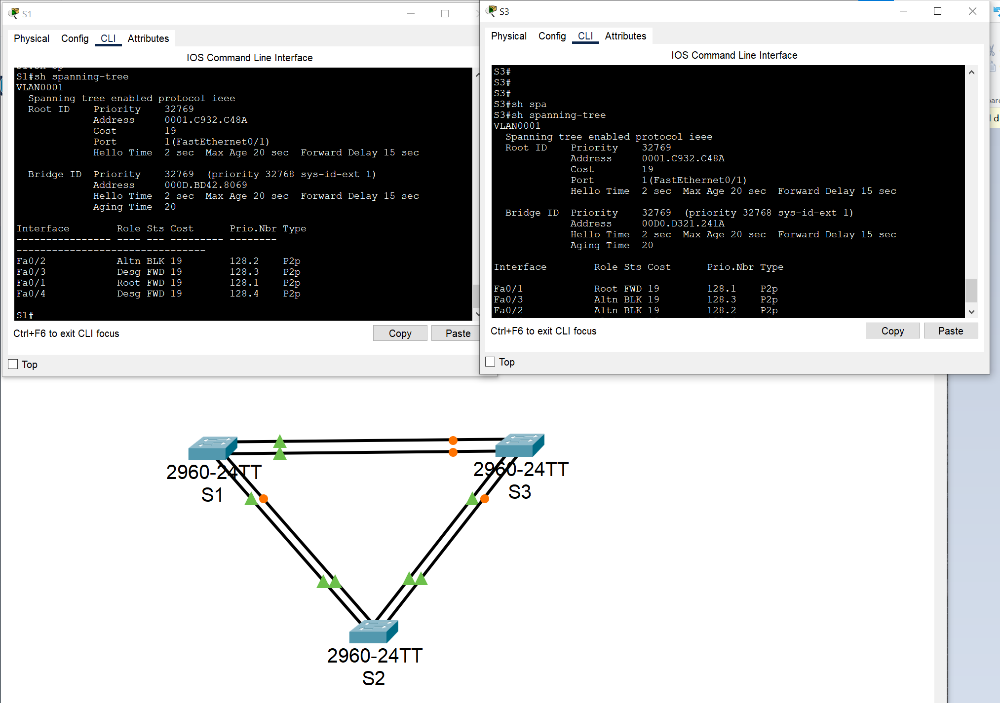

# Развертывание коммутируемой сети с резервными каналами  


### Задачи:
#### Часть 1. Создание сети и настройка основных параметров устройства
#### Часть 2. Выбор корневого моста
#### Часть 3. Наблюдение за процессом выбора протоколом STP порта, исходя из стоимости портов
#### Часть 4. Наблюдение за процессом выбора протоколом STP порта, исходя из приоритета портов

## Топология: 
  

### Решение:
#### Часть 1: 
Базовые настройки коммутаторов выполнены, IP адреса для VLAN 1 прописаны  


Проверьте способность компьютеров обмениваться эхо-запросами.  
* Успешно ли выполняется эхо-запрос от коммутатора S1 на коммутатор S2?  
* Успешно ли выполняется эхо-запрос от коммутатора S1 на коммутатор S3?  
* Успешно ли выполняется эхо-запрос от коммутатора S2 на коммутатор S3?  
*-Все успешно*  
  

#### Часть 2:  Определение корневого моста
⦁	Отключите все порты на коммутаторах.  
⦁	Настройте подключенные порты в качестве транковых.  
⦁	Включите порты F0/2 и F0/4 на всех коммутаторах.  
⦁	Отобразите данные протокола spanning-tree.  
  

Какой коммутатор является корневым мостом?  
*- Коммутатор S2*  

Почему этот коммутатор был выбран протоколом spanning-tree в качестве корневого моста?  
*- Как было описано выше в самом задании:  
Приоритет идентификатора моста рассчитывается путем сложения значений приоритета и расширенного идентификатора системы.  
Расширенным идентификатором системы всегда является номер сети VLAN. В нашем случае все 3 имеют равные значения приоритета и идентификатора, получается был выбран свич с самым низким значением MAC-адерса.  
**0001**.C932.C48A*  

Какие порты на коммутаторе являются корневыми портами?  
*-Порт Fa0/2 на коммутаторе S1  
-Порт Fa0/2 на коммутаторе S3*  

Какие порты на коммутаторе являются назначенными портами?  
*-Порт Fa0/4 на коммутаторе S1  
-Порты Fa0/2 и Fa0/4 на коммутаторе S2*  

Какой порт отображается в качестве альтернативного и в настоящее время заблокирован?  
*-Порт Fa0/4 на коммутаторе S3*  

Почему протокол spanning-tree выбрал этот порт в качестве невыделенного (заблокированного) порта?  
*- Как тоже описано ниже в самом задании:  
Алгоритм STP определяет, какие порты будут заблокированы исходя из стоимости пути.  
В нашем случае стоимось одинаковая, следовательно дальше сравнивается Bridge ID, у коммутатора S3 оказался самый высокий BID (00D0.D321.241A) и оба порта имеют одинаковую стоимость, следовательно порт с наибольшим значением блокируется. Также он не подключен напрямую в коммутатор корневого моста.*  

#### Часть 3: Наблюдение за процессом выбора протоколом STP порта, исходя из стоимости портов  
⦁	Измените стоимость порта.  
⦁	Просмотрите изменения протокола spanning-tree.  

  

Почему протокол spanning-tree заменяет ранее заблокированный порт на назначенный порт и блокирует порт, который был назначенным портом на другом коммутаторе?
*- Cost и Root ID сменились на 18 на свиче S3, следовательно через него можно "быстрее" добраться до корнегвого моста. Т.к. первым при выборе сравнивается Cost и только потом BID. На коммутаторе S1 приорет порта Fa0/4 выше, поэтому он и блокируется.*  

⦁	Удалите изменения стоимости порта.  
```
S3(config)#interface fastEthernet 0/2
S3(config-if)#no spanning-tree vlan 1 cost 18
S3# sh spanning-tree 
VLAN0001
  Spanning tree enabled protocol ieee
  Root ID    Priority    32769
             Address     0001.C932.C48A
             Cost        19
             Port        2(FastEthernet0/2)
             Hello Time  2 sec  Max Age 20 sec  Forward Delay 15 sec

  Bridge ID  Priority    32769  (priority 32768 sys-id-ext 1)
             Address     00D0.D321.241A
             Hello Time  2 sec  Max Age 20 sec  Forward Delay 15 sec
             Aging Time  20

Interface        Role Sts Cost      Prio.Nbr Type
---------------- ---- --- --------- -------- --------------------------------
Fa0/2            Root FWD 19        128.2    P2p
Fa0/4            Altn BLK 19        128.4    P2p
```

#### Часть 4: Наблюдение за процессом выбора протоколом STP порта, исходя из стоимости портов  

⦁	Включите порты F0/1 и F0/3 на всех коммутаторах.  

  

Какой порт выбран протоколом STP в качестве порта корневого моста на каждом коммутаторе некорневого моста?  
*-Порт Fa0/1 на коммутаторе S1  
-Порт Fa0/1 на коммутаторе S3*  

Почему протокол STP выбрал эти порты в качестве портов корневого моста на этих коммутаторах?  
*- Потому что они имеют наименьшей приоритет (128+1) на обоих коммутаторах.*

#### Вопросы для повторения
⦁	Какое значение протокол STP использует первым после выбора корневого моста, чтобы определить выбор порта?  
*- Стоимость пути / Cost*  
⦁	Если первое значение на двух портах одинаково, какое следующее значение будет использовать протокол STP при выборе порта?  
*- Bride ID*  
⦁	Если оба значения на двух портах равны, каким будет следующее значение, которое использует протокол STP при выборе порта?  
*- Приоритеты портов (по умолчанию значение приоритета = 128. К этому значению приплюсовывается номер самого порта)*
