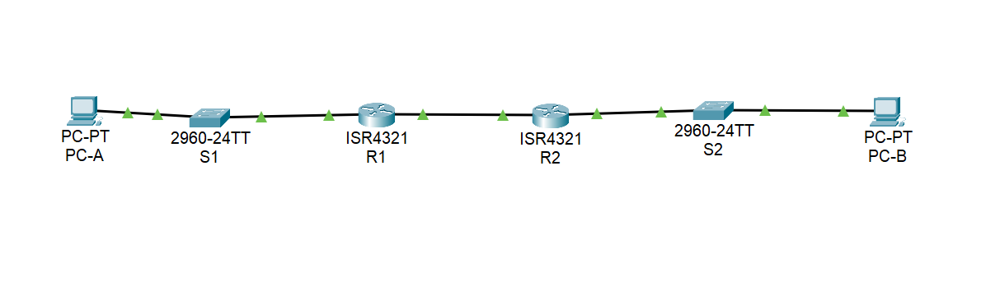
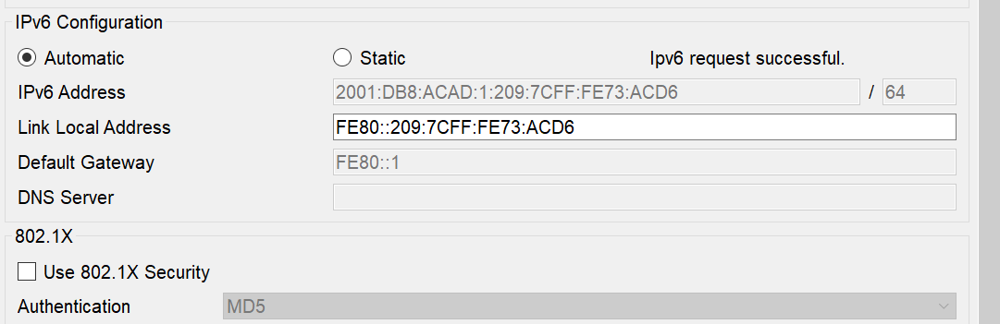
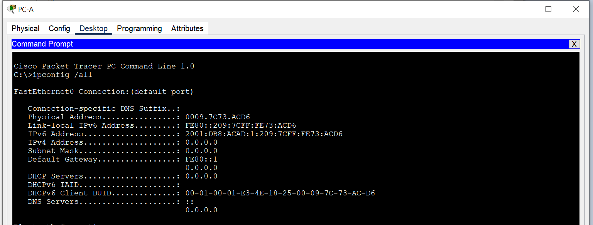
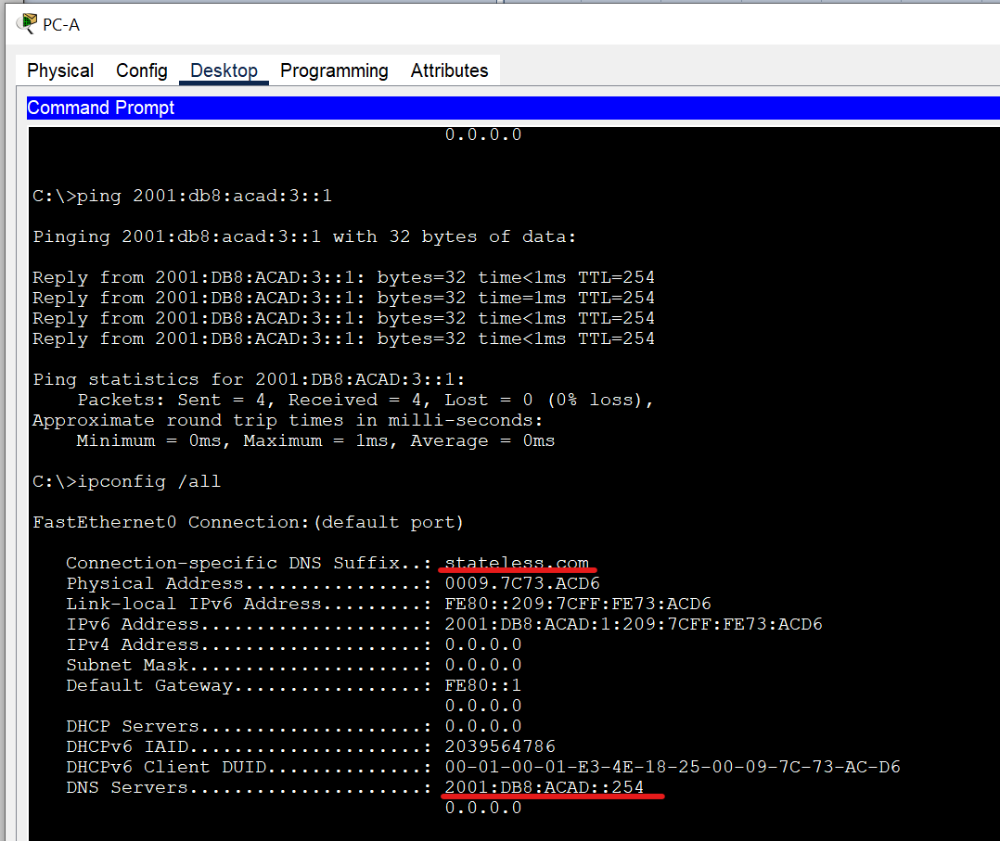
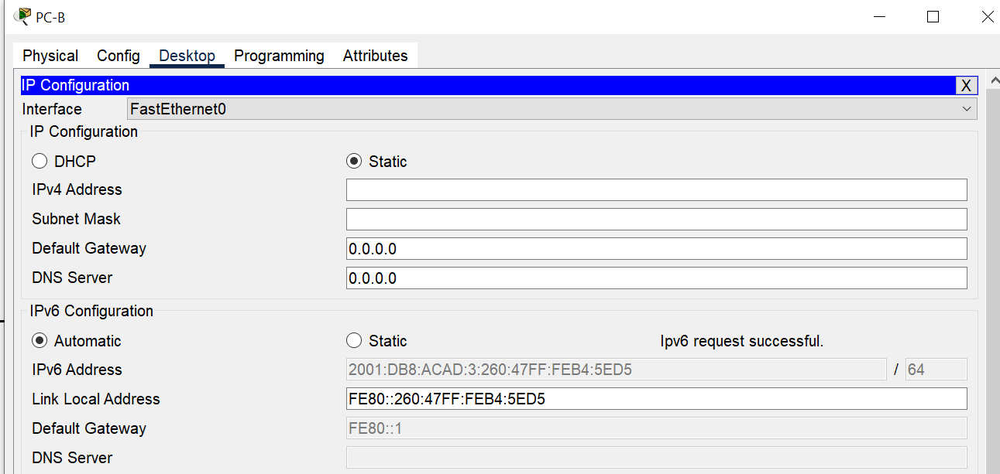

# Реализация DHCPv6   

### Задачи:
#### Часть 1. Создание сети и настройка основных параметров устройства
#### Часть 2. Проверка назначения адреса SLAAC от R1
#### Часть 3. Настройка и проверка сервера DHCPv6 без гражданства на R1
#### Часть 4. Настройка и проверка состояния DHCPv6 сервера на R1
#### Часть 5. Настройка и проверка DHCPv6 Relay на R2

## Топология: 
  

### Решение:
#### Часть 1: 
Базовые настройки коммутаторов и роутеров выполнены, пароли поставлены.  
Таблица адресации:  
Устройство | Интерфейс | IPv6-адрес |
:---: | :---: | :---: 
R1 | G0/0/0 | 2001:db8:acad:2::1/64 
R1 |        | fe80::1 
R1 | G0/0/1| 2001:db8:acad:1::1/64 
R1 |        | fe80::1 
R2 | G0/0/0 | 2001:db8:acad:2::2/64 
R2 |        | fe80::2 
R2 | G0/0/1 | 2001:db8:acad:3::1/64 
R2 |        | fe80::1 
PC-A | NIC | DHCP
PC-B | NIC | DHCP 


```
R1(config)#ipv6 unicast-routing
R1(config)#ipv6 route ::/0 2001:db8:acad:2::2
R1#sh run
!
interface GigabitEthernet0/0/0
 no ip address
 duplex auto
 speed auto
 ipv6 address FE80::1 link-local
 ipv6 address 2001:DB8:ACAD:2::1/64
!
interface GigabitEthernet0/0/1
 no ip address
 duplex auto
 speed auto
 ipv6 address FE80::1 link-local
 ipv6 address 2001:DB8:ACAD:1::1/64
!
R1#
R1#ping 2001:db8:acad:3::1
Type escape sequence to abort.
Sending 5, 100-byte ICMP Echos to 2001:db8:acad:3::1, timeout is 2 seconds:
!!!!!
Success rate is 100 percent (5/5), round-trip min/avg/max = 0/0/0 ms
```  
  
#### Часть 2. Проверка назначения адреса SLAAC от R1  
    

#### Часть 3. Настройка R1 для предоставления DHCPv6 без состояния для PC-A.  


```
R1(config)#ipv6 dhcp pool R1-STATELESS
R1(config-dhcpv6)#dns-server 2001:db8:acad::254
R1(config-dhcpv6)#domain-name stateless.com
R1(config-dhcpv6)#ex
R1(config)#
R1(config)#interface gigabitEthernet 0/0/1
R1(config-if)#ipv6 nd other-config-flag 
R1(config-if)#ipv6 dhcp server R1-STATELESS
R1(config-if)#ex
```  
⦁	Проверьте вывод ipconfig /all на PC-A   
⦁	Тестирование подключения с помощью пинга IP-адреса интерфейса G0/1 R2.  
Пинг проходит, DNS сервер и суффикс появились:  
  

#### Часть 4. Настройка и проверка состояния DHCPv6 сервера на R1  
```
R1(config)#ipv6 dhcp pool R2-STATEFUL
R1(config-dhcpv6)#address prefix 2001:db8:acad:3:aaa::/80
R1(config-dhcpv6)#dns-server 2001:db8:acad::254
R1(config-dhcpv6)#domain-name STATEFUL.com
R1(config-dhcpv6)#ex
R1(config)#
R1(config)#interface gigabitEthernet 0/0/0
R1(config-if)#ipv6 dhcp server R2-STATEFUL
```

⦁	Включите PC-B и проверьте адрес SLAAC, который он генерирует.  
    

⦁	Настройте R2 в качестве агента DHCP-ретрансляции для локальной сети на G0/0/1.  
В PT отсутсвтует команда **ipv6 dhcp relay**, доделать лабу до конца нет возможности.
```
R2(config-if)#ipv6 dhcp ?
  client  Act as an IPv6 DHCP client
  server  Act as an IPv6 DHCP server
```
