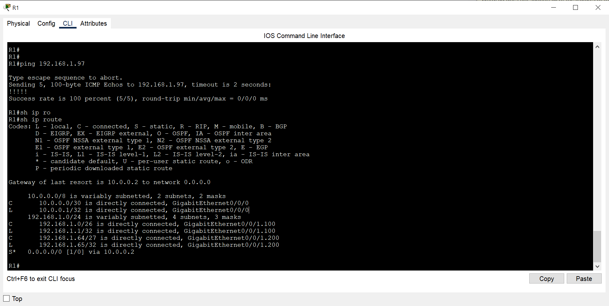
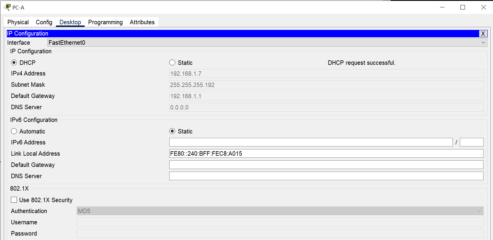
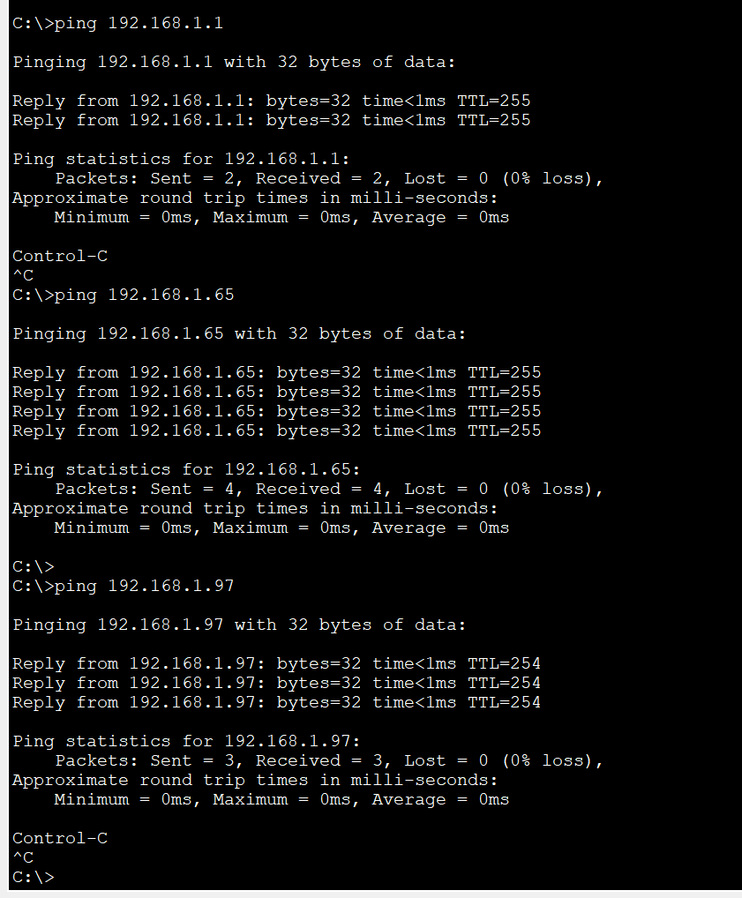
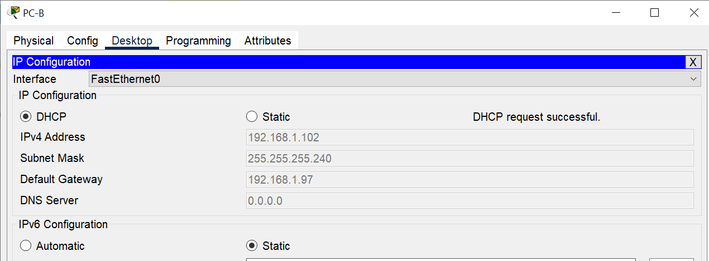

# Реализация DHCPv4   

### Задачи:
#### Часть 1. Создание сети и настройка основных параметров устройства
#### Часть 2. Настройка и проверка двух серверов DHCPv4 на R1
#### Часть 3. Настройка и проверка DHCP-ретрансляции на R2

## Топология: 
  

### Решение:
#### Часть 1: 
Базовые настройки коммутаторов и роутеров выполнены, пароли поставлены.  
Схема адресации:  
Устройство | Интерфейс | IP-адрес | Маска подсети | Default Gateway
:---: | :---: | :---: | :---: | :---:
R1 | G0/0/0 | 10.0.0.1 | 255.255.255.252 | 
R1 | G0/0/1 | - | - | -
R1 | G0/0/1.100 | 192.168.1.1 | 255.255.255.192 | -
R1 | G0/0/1.200 | 192.168.1.65 | 255.255.255.224 | -
R1 | G0/0/1.1000 | - | - | -
R2 | G0/0/0 | 10.0.0.2 | 255.255.255.252 | -
R2 | G0/0/1 | 192.168.1.97 | 255.255.255.240 | -
S1 | VLAN 200 | 192.168.1.66 | 255.255.255.224 | 192.168.1.65
S2 | VLAN 1 | 192.168.1.98 | 255.255.255.240 | 192.168.1.97
PC-A | NIC | DHCP | DHCP | DHCP
PC-B | NIC | DHCP | DHCP | DHCP


⦁	Настройка маршрутизации между сетями VLAN на маршрутизаторе R1  
```
R1#sh ip interface brief 
Interface               IP-Address      OK? Method Status                Protocol 
GigabitEthernet0/0/0    unassigned      YES unset  administratively down down 
GigabitEthernet0/0/1    unassigned      YES unset  up                    up 
GigabitEthernet0/0/1.100 192.168.1.1     YES manual up                    up 
GigabitEthernet0/0/1.200 192.168.1.65    YES manual up                    up 
GigabitEthernet0/0/1.1000 unassigned      YES unset  up                    up 
Vlan1                   unassigned      YES unset  administratively down down
```

⦁	Настройте G0/1 на R2, затем G0/0/0 и статическую маршрутизацию для обоих маршрутизаторов   
⦁	Убедитесь, что статическая маршрутизация работает с помощью пинга до адреса G0/0/1 R2 от R1.  

```
R1(config)#ip route 0.0.0.0 0.0.0.0 10.0.0.2
R2(config)#ip route 0.0.0.0 0.0.0.0 10.0.0.1   
```
Пинг: 
    


⦁	Создайте сети VLAN на коммутаторе S1.
```
S1#sh vlan 

VLAN Name                             Status    Ports
---- -------------------------------- --------- -------------------------------
1    default                          active    Fa0/5
100  Client                           active    Fa0/6
200  Management                       active    
999  Parking_Lot                      active    Fa0/1, Fa0/2, Fa0/3, Fa0/4
                                                Fa0/7, Fa0/8, Fa0/9, Fa0/10
                                                Fa0/11, Fa0/12, Fa0/13, Fa0/14
                                                Fa0/15, Fa0/16, Fa0/17, Fa0/18
                                                Fa0/19, Fa0/20, Fa0/21, Fa0/22
                                                Fa0/23, Fa0/24, Gig0/1, Gig0/2
1000 Native                           active    
1002 fddi-default                     active    
1003 token-ring-default               active    
1004 fddinet-default                  active    
1005 trnet-default                    active    
S1#
S1#sh ip interface br
Interface              IP-Address      OK? Method Status                Protocol 
FastEthernet0/1        unassigned      YES manual administratively down down 
FastEthernet0/2        unassigned      YES manual administratively down down 
FastEthernet0/3        unassigned      YES manual administratively down down 
FastEthernet0/4        unassigned      YES manual administratively down down 
FastEthernet0/5        unassigned      YES manual up                    up 
FastEthernet0/6        unassigned      YES manual up                    up 
FastEthernet0/7        unassigned      YES manual administratively down down 
.....
Vlan1                  unassigned      YES manual administratively down down 
Vlan200                192.168.1.66    YES manual up                    down
S1#
```  

Почему интерфейс F0/5 указан в VLAN 1?  
*- Vlan 1 является default Vlan и мы не настраивали порт в статическом режиме или режиме trunk*  


⦁	Вручную настройте интерфейс S1 F0/5 в качестве транка 802.1Q.
```
S1(config-if)#switchport mode trunk 
%LINEPROTO-5-UPDOWN: Line protocol on Interface FastEthernet0/5, changed state to down
%LINEPROTO-5-UPDOWN: Line protocol on Interface FastEthernet0/5, changed state to up
%LINEPROTO-5-UPDOWN: Line protocol on Interface Vlan200, changed state to up
S1(config-if)#switchport trunk native vlan 1000
S1(config-if)#switchport trunk allowed vlan 100,200,1000
S1(config-if)#
```

Какой IP-адрес был бы у ПК, если бы он был подключен к сети с помощью DHCP?  
*- Скорее всего следующий свободный адрес в подсети 192.168.1.1/28, то есть **192.168.1.2**  
Но возможно DHCP запрос попытался бы взять уже занятый адрес..*   


#### Часть 2. Настройка и проверка двух серверов DHCPv4 на R1  
⦁	Настройте R1 с пулами DHCPv4 для двух поддерживаемых подсетей.   
! В PT на роутере 4321 нет возможности настроить время аренды, комнада leasing неизвестна.
     


⦁	Проверка конфигурации сервера DHCPv4  
! В PT на роутере 4321 нет возможности выполнить команду show ip dhcp server statistics.  
```
R1#sh ip dhcp pool 
Pool Client :
 Utilization mark (high/low)    : 100 / 0
 Subnet size (first/next)       : 0 / 0 
 Total addresses                : 62
 Leased addresses               : 1
 Excluded addresses             : 2
 Pending event                  : none

 1 subnet is currently in the pool
 Current index        IP address range                    Leased/Excluded/Total
 192.168.1.1          192.168.1.1      - 192.168.1.62      0    / 2     / 62

Pool R2_Client_LAN :
 Utilization mark (high/low)    : 100 / 0
 Subnet size (first/next)       : 0 / 0 
 Total addresses                : 14
 Leased addresses               : 0
 Excluded addresses             : 2
 Pending event                  : none

 1 subnet is currently in the pool
 Current index        IP address range                    Leased/Excluded/Total
 192.168.1.97         192.168.1.97     - 192.168.1.110     0    / 2     / 14
R1#
R1#sh ip dhcp binding 
IP address       Client-ID/              Lease expiration        Type
                 Hardware address
R1#
R1#sh ip dhcp ?
  binding   DHCP address bindings
  conflict  DHCP address conflicts
  pool      DHCP pools information
  relay     Miscellaneous DHCP relay information
```

⦁	Попытка получить IP-адрес от DHCP на PC-A  
   
Проверка:  
  

⦁	Настройка и проверка DHCP-ретрансляции на R2  
```
R2(config)#interface gigabitEthernet 0/0/1
R2(config-if)#ip helper-address 10.0.0.1
```
⦁	Попытка получить IP-адрес от DHCP на PC-B
   
Проверка:  
    

⦁	Выполните show ip dhcp binding  
```
R1#sh ip dhcp binding 
IP address       Client-ID/              Lease expiration        Type
                 Hardware address
192.168.1.7      0040.0BC8.A015           --                     Automatic
192.168.1.102    0010.113D.083B           --                     Automatic
R1#
```
