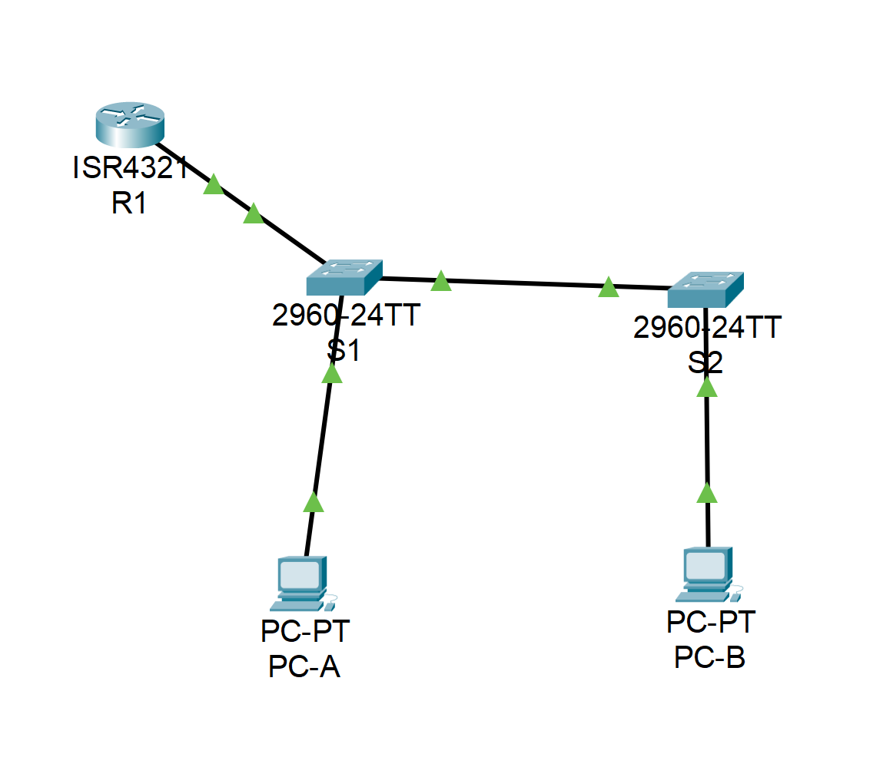
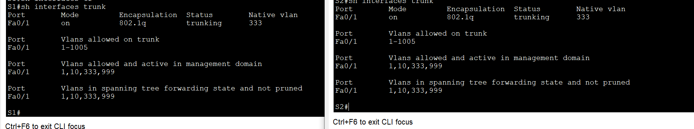
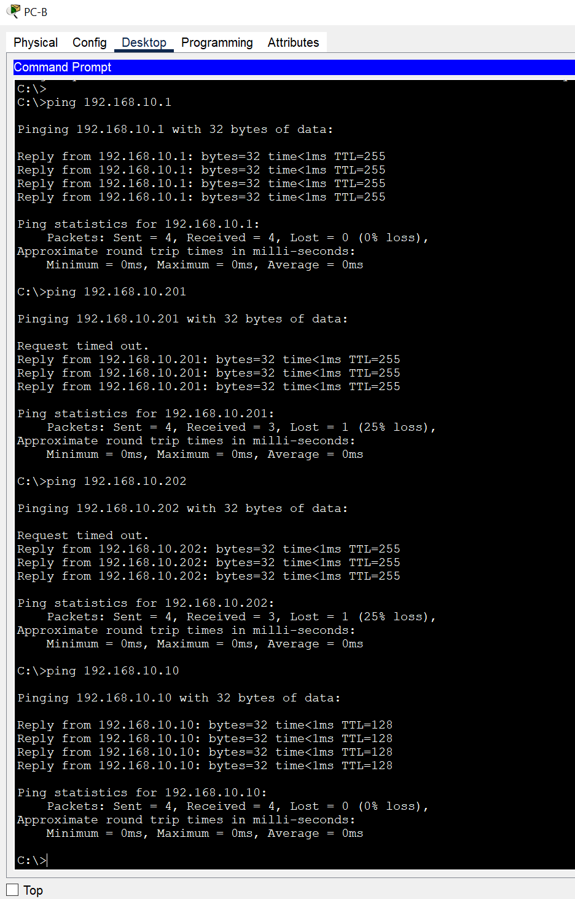

# Конфигурация безопасности коммутатора

### Задачи:
#### Часть 1. Настройка основного сетевого устройства.
#### Часть 2. Настройка сетей VLAN.
#### Часть 3. Настройки безопасности коммутатора.

## Топология: 
  


Таблица адресации:  
Устройство | Интерфейс | IP-адрес | Маска подсети 
:---: | :---: | :---: | :---: 
R1 | G0/0/1 | 192.168.10.1 | 255.255.255.0
R1 | Loopback 0  | 10.10.1.1 | 255.255.255.0
S1 | VLAN 10 | 192.168.10.201 | 255.255.255.0 
S2 | VLAN 10 | 192.168.10.202 | 255.255.255.0 
PC-A | NIC | DHCP | 255.255.255.0
PC-B | NIC | DHCP | 255.255.255.0

#### Часть 1.

Конфигурация из задания загружена на R1:  
```
R1#sh ip int brief 
Interface              IP-Address      OK? Method Status                Protocol 
GigabitEthernet0/0/0   unassigned      YES unset  administratively down down 
GigabitEthernet0/0/1   192.168.10.1    YES manual up                    up 
Loopback0              10.10.1.1       YES manual up                    up 
Vlan1                  unassigned      YES unset  administratively down down
```

#### Часть 2. Настройка сетей VLAN.
VLAN и SVI на свчиах настроены:

```
S1#sh run
!
interface Vlan10
 description Management
 ip address 192.168.10.201 255.255.255.0
!
ip default-gateway 192.168.10.1

S1#sh vlan brief 

VLAN Name                             Status    Ports
---- -------------------------------- --------- -------------------------------
1    default                          active    Fa0/1, Fa0/2, Fa0/3, Fa0/4
                                                Fa0/5, Fa0/6, Fa0/7, Fa0/8
                                                Fa0/9, Fa0/10, Fa0/11, Fa0/12
                                                Fa0/13, Fa0/14, Fa0/15, Fa0/16
                                                Fa0/17, Fa0/18, Fa0/19, Fa0/20
                                                Fa0/21, Fa0/22, Fa0/23, Fa0/24
                                                Gig0/1, Gig0/2
10   Management                       active    
333  Native                           active    
999  ParkingLot                       active    
1002 fddi-default                     active    
1003 token-ring-default               active    
1004 fddinet-default                  active    
1005 trnet-default                    active    
```

#### Часть 3. Настройки безопасности коммутатора.
 

⦁	Отключить согласование DTP F0/1 на S1 и S2.  

```
S1(config)#interface fastEthernet 0/1
S1(config-if)#switchport nonegotiate
S1(config-if)#do sh interfaces fastEthernet 0/1 switchport | include Negot
Negotiation of Trunking: Off
```  

### Документирование и реализация функций безопасности порта.  
Функция | Настройка по умолчанию
:---: | :---:
Защита портов | Disabled
Максимальное количество записей MAC-адресов | 1
Режим проверки на нарушение безопасности | Shutdown
Aging Time | 0 mins
Aging Type | Absolute
Secure Static Address Aging | Disabled
Sticky MAC Address | 0

Изменение настроек port-security  
! В PT нет возможности установить настройку **Aging type: inactive**
```
S1(config)#interface fastEthernet 0/6
S1(config-if)#switchport port-security maximum 3
S1(config-if)#switchport port-security aging time 60
S1(config-if)#switchport port-security violation restrict
S1(config-if)#switchport port-security aging ?
  time  Port-security aging time
S1(config-if)#
S1(config-if)#
S1(config-if)#do sh port-sec int f0/6
Port Security              : Enabled
Port Status                : Secure-up
Violation Mode             : Restrict
Aging Time                 : 60 mins
Aging Type                 : Absolute
SecureStatic Address Aging : Disabled
Maximum MAC Addresses      : 3
Total MAC Addresses        : 1
Configured MAC Addresses   : 0
Sticky MAC Addresses       : 0
Last Source Address:Vlan   : 0000.0000.0000:0
Security Violation Count   : 0
S1#
S1#
S1#sh port-security address 
               Secure Mac Address Table
-----------------------------------------------------------------------------
Vlan    Mac Address       Type                          Ports   Remaining Age
                                                                   (mins)
----    -----------       ----                          -----   -------------
10	000C.CF7A.0DB8	DynamicConfigured	FastEthernet0/6		-
-----------------------------------------------------------------------------
Total Addresses in System (excluding one mac per port)     : 0
Max Addresses limit in System (excluding one mac per port) : 1024
```  

⦁	Включите безопасность порта для F0/18 на S2  
  
```
S2#sh port-security interface fastEthernet 0/18
Port Security              : Enabled
Port Status                : Secure-up
Violation Mode             : Protect
Aging Time                 : 60 mins
Aging Type                 : Absolute
SecureStatic Address Aging : Disabled
Maximum MAC Addresses      : 2
Total MAC Addresses        : 1
Configured MAC Addresses   : 0
Sticky MAC Addresses       : 1
Last Source Address:Vlan   : 0060.4775.2B45:10
Security Violation Count   : 0

S2#
S2#sh port-security address 
               Secure Mac Address Table
-----------------------------------------------------------------------------
Vlan    Mac Address       Type                          Ports   Remaining Age
                                                                   (mins)
----    -----------       ----                          -----   -------------
  10    0060.4775.2B45    SecureSticky                  Fa0/18       -
-----------------------------------------------------------------------------
Total Addresses in System (excluding one mac per port)     : 0
Max Addresses limit in System (excluding one mac per port) : 1024
S2#
```  
  
⦁	Реализовать безопасность DHCP snooping.  
```
S2#sh ip dhcp snooping 
Switch DHCP snooping is enabled
DHCP snooping is configured on following VLANs:
10
Insertion of option 82 is enabled
Option 82 on untrusted port is not allowed
Verification of hwaddr field is disabled
Interface                  Trusted    Rate limit (pps)
-----------------------    -------    ----------------
FastEthernet0/18           no         5               
FastEthernet0/1            yes        unlimited     
```

⦁ На PC-B выполнены команды **ipconfig /release** и **ipconfig /renew**, вывод snooping binding с S2:  

```
S2#sh ip dhcp snooping binding 
MacAddress          IpAddress        Lease(sec)  Type           VLAN  Interface
------------------  ---------------  ----------  -------------  ----  -----------------
00:60:47:75:2B:45   192.168.10.11    0           dhcp-snooping  10    FastEthernet0/18
Total number of bindings: 1
```

⦁	Реализация PortFast и BPDU Guard  
```
S1#sh running-config | begin 0/6
interface FastEthernet0/6
 description Link to PC-A
 switchport access vlan 10
 switchport mode access
 switchport port-security
 switchport port-security maximum 3
 switchport port-security violation restrict 
 switchport port-security aging time 60
 spanning-tree portfast
 spanning-tree bpduguard enable
```

⦁	Проверьте наличие сквозного подключения.


### Вопросы для повторения
⦁	С точки зрения безопасности порта на S2, почему нет значения таймера для оставшегося возраста в минутах, когда было сконфигурировано динамическое обучение - sticky?  
*- sticky-адреса привязаны к порту навсегда, пока не перезагруить порт или не будут очищены вручную.*  
⦁	Что касается безопасности порта на S2, если вы загружаете скрипт текущей конфигурации на S2, почему порту 18 на PC-B никогда не получит IP-адрес через DHCP?  
*- Честно скзать не очень понял вопрос, какой именно скрипт..*   
⦁	Что касается безопасности порта, в чем разница между типом абсолютного устаревания и типом устаревание по неактивности?  
*- Абсолютное устаревание удаляет записи MAC-адресов через указанное время, независимо от активности, есть трафик или нет. 
Устаревание по неактивности удаляет записи только тогда, когда устройство не отправляло трафик в течение определенного времени.*
